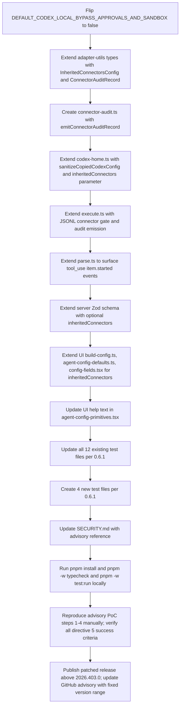

# Technical Specification

# 0. Agent Action Plan

## 0.1 Intent Clarification

### 0.1.1 Core Security Objective

Based on the security concern described in advisory **GHSA-gqqj-85qm-8qhf** (CVSS 8.7 High, CWE-284 Improper Access Control), the Blitzy platform understands that the security vulnerability to resolve is **unintended cross-surface privilege escalation from ChatGPT/OpenAI Apps into Paperclip-managed `codex_local` agent runtimes**. A user who has connected app connectors (Gmail, Google Drive, Google Calendar, GitHub, Linear, etc.) inside the ChatGPT / OpenAI Apps UI has those connector credentials stored by the Codex CLI under `~/.codex/plugins/cache/openai-curated/**/.app.json`. When Paperclip spawns a `codex_local` agent, the current adapter (`packages/adapters/codex-local`) seeds its managed `CODEX_HOME` from the shared Codex home and launches Codex with `--dangerously-bypass-approvals-and-sandbox` as the **default**, silently exposing those inherited connectors — including write-capable tools such as `gmail_send_email` — to the model without user opt-in or approval gates. The advisory's PoC demonstrates an unprompted `gmail_send_email` invocation from a freshly created `codex_local` agent.

- **Vulnerability category:** Multiple vulnerabilities — (a) **improper access control / confused-deputy inheritance** of cross-surface connector state, (b) **insecure default configuration** for approval and sandbox bypass, (c) **missing audit provenance** for connector-mediated tool invocations.
- **Severity level:** **High** (CVSS 8.7, CWE-284). Attack requires local code execution surface (a `codex_local` agent the operator created), but produces outward write actions (sending email, creating calendar events, filing issues) on the user's connected third-party accounts without any in-product consent ceremony.
- **Affected versions:** `paperclipai/paperclip` npm package versions `0` through `2026.403.0` (all releases to date).
- **Fixed version target:** Next release immediately above `2026.403.0`, with the GitHub Security Advisory updated to reflect the fixed range.

Explicit security requirements derived from the four CRITICAL directives in the user prompt:

- **Block default inheritance** of OpenAI-curated app connectors into `codex_local` runtimes unless a Paperclip-side opt-in is present on the agent.
- **Require explicit Paperclip-side opt-in** before any connector-mediated *outward* (write/send/update/create/delete/modify) action executes, with enforcement at the **runtime invocation layer**, not only in the tool manifest.
- **Flip the default** of `dangerouslyBypassApprovalsAndSandbox` from `true` to `false` on the server-side `codex_local` agent creation path.
- **Emit structured audit records** for every connector-mediated action invoked by a `codex_local` runtime (timestamp, agent ID, connector source, connector name, tool name, action classification, opt-in state, outcome).
- **Validate remediation** by re-running the advisory PoC and asserting the success/regression criteria hold.

Implicit security requirements surfaced from the constraints and the existing architecture:

- **Backward compatibility**: existing agents that explicitly pass `dangerouslyBypassApprovalsAndSandbox: true` must continue to work; only the omitted/default case changes.
- **Additive API shape**: no existing fields on the agent creation API may be renamed or removed. The new opt-in field (`inheritedConnectors`) is purely additive.
- **Cross-surface boundary preservation**: Paperclip must NOT mutate cached manifests under `~/.codex/plugins/cache/openai-curated/` — they are read-through state owned by the Codex CLI.
- **Zero disruption to Paperclip-native connectors**: `paperclip-native` plugin tools (registered via `plugin-tool-registry.ts` / `plugin-tool-dispatcher.ts`) are unaffected beyond the addition of audit emission.
- **Regression coverage**: the advisory reproduction must be captured as a non-regression test so the attack vector cannot silently reopen.

### 0.1.2 Special Instructions and Constraints

The following user-specified directives are captured verbatim and treated as non-negotiable SYSTEM BOUNDARIES:

- *User System Boundary:* **"MUST NOT modify the Codex protocol itself, upstream OpenAI SDK surfaces, or connector definitions sourced from `openai-curated` cache files (read-through only; no mutation of cached manifests)."**
- *User System Boundary:* **"MUST NOT alter connectors intentionally configured inside Paperclip (`paperclip-native` source) beyond adding audit emission."**
- *User System Boundary:* **"MUST NOT remove or rename existing fields on the agent creation API. New opt-in fields are additive only."**
- *User System Boundary:* **"MUST preserve existing behavior for agents where callers explicitly pass `dangerouslyBypassApprovalsAndSandbox: true` — the flag remains functional, only the default changes."**

User-provided validation examples preserved exactly as specified:

- *User Example (Directive 1 validation):* Given Gmail connected only in the ChatGPT/OpenAI apps UI, a newly created `codex_local` agent MUST NOT expose `mcp__codex_apps__gmail_*` tools (or any `mcp__codex_apps__*` tools sourced from OpenAI-curated cache) in its tool registry. Reproduce advisory PoC steps 1–3; assert `gmail_get_profile` returns a tool-not-available error, not a profile payload.
- *User Example (Directive 2 validation):* With read opt-in enabled and write opt-in absent, invoke `gmail_search_emails` (MUST succeed) and `gmail_send_email` (MUST fail with an authorization error that names the missing opt-in).
- *User Example (Directive 3 validation):* POST an agent creation request with `dangerouslyBypassApprovalsAndSandbox` field omitted from the body; assert the persisted agent record shows `dangerouslyBypassApprovalsAndSandbox: false` and runtime behavior honors approval/sandbox gates.
- *User Example (Directive 4 validation):* Invoke one allowed read, one denied write, and one invocation against a non-inherited connector; assert exactly three audit records are produced with correct classification (`read` | `write`) and outcome (`allowed` | `denied`) fields, with denied records carrying a `reason` field naming the missing opt-in or default-block.
- *User Example (Directive 5 regression criterion):* An agent explicitly configured with `inheritedConnectors.allowWrite: true` for Gmail MUST still be able to invoke `gmail_send_email` successfully, confirming the opt-in path is functional and the fix is not a blanket disablement.

Web search requirements conducted as part of this planning phase:

- CVE / GHSA databases: advisory `GHSA-gqqj-85qm-8qhf` confirmed private at time of planning (per `.agents/skills/deal-with-security-advisory/SKILL.md` confidentiality requirements).
- OpenAI Codex developer docs for connector/plugin architecture (`developers.openai.com/codex/plugins/build`, `developers.openai.com/codex/config-reference`, `developers.openai.com/codex/config-sample`, `developers.openai.com/codex/changelog`).
- Codex CLI plugin internals (`deepwiki.com/openai/codex/5.11-plugins-system`) confirming `.app.json`, `.mcp.json`, `MarketplacePluginSource`, `AppToolPolicy`, and the `mcp__<server>__<tool>` naming convention.
- Open issue `openai/codex#17588` confirming that config-based `enabled = false` disables for connectors/apps are not consistently honored by the Codex CLI, which is precisely why Paperclip must enforce the block at its own resolver layer rather than relying on downstream config overrides.

- **Change scope preference:** **Minimal**. Per the `deal-with-security-advisory` SKILL (`⚠️ Fix should be minimal and focused`), this plan touches only the files required to close the attack vector and its identified adjacent vectors. No unrelated refactors, cosmetic changes, or non-security dependency bumps are in scope.

### 0.1.3 Technical Interpretation

This security vulnerability translates to the following technical fix strategy, expressed as four concrete, composable mitigations applied in-place inside the `codex_local` adapter and the server-side agent-creation path:

- **To resolve the improper-inheritance vector**, we will modify `packages/adapters/codex-local/src/server/codex-home.ts` so that `prepareManagedCodexHome` (a) never copies or symlinks anything from `<sharedCodexHome>/plugins/**`, `<sharedCodexHome>/cache/**`, or any `openai-curated` subtree, (b) sanitizes the copied `config.toml` by stripping `[plugins."*@openai-curated"]`, `[apps.*]`, and `[mcp_servers.*]` tables to a Paperclip-managed allowlist derived from the agent's `inheritedConnectors` config, and (c) writes a Paperclip-managed `plugins/cache/openai-curated/` directory that contains **only** the `.app.json` manifests explicitly opted in by the agent. The resolver will never read-through to the shared `~/.codex/plugins/cache/openai-curated/` directory for any connector not listed in `inheritedConnectors.allowRead`.
- **To resolve the missing-opt-in write vector**, we will add a new additive field `inheritedConnectors` to the `codex_local` adapter config schema with shape `{ allowRead: string[]; allowWrite: string[] }` (both default to `[]`). We will enforce at the runtime invocation layer (inside `packages/adapters/codex-local/src/server/execute.ts`) by wrapping the Codex JSONL stream: any `item.started` of type `tool_use` naming an `mcp__codex_apps__*` tool classified as a **write** action (matching `send_*`, `send_email`, `send_draft`, `update_*`, `create_*`, `delete_*`, `modify_*`, and the explicit allowlist mirrors the Codex `destructive_enabled` convention) when the connector is not in `inheritedConnectors.allowWrite` will be intercepted — the child process receives a SIGTERM and the run terminates with an authorization error that names the missing opt-in. The in-manifest layer (config.toml-side `destructive_enabled = false` on non-opted connectors) is a defense-in-depth second gate but not the primary enforcement, matching the directive wording "at the runtime invocation layer, not only in the tool manifest".
- **To resolve the insecure-default vector**, we will change the constant `DEFAULT_CODEX_LOCAL_BYPASS_APPROVALS_AND_SANDBOX` in `packages/adapters/codex-local/src/index.ts` from `true` to `false`, and propagate the new default through all code paths that rely on it: the server-side `applyCreateDefaultsByAdapterType` helper in `server/src/routes/agents.ts`, the UI-side form defaults in `ui/src/pages/NewAgent.tsx`, `ui/src/components/AgentConfigForm.tsx`, `ui/src/components/OnboardingWizard.tsx`, and the adapter-internal `buildCodexLocalConfig` in `packages/adapters/codex-local/src/ui/build-config.ts`. The UI toggle `CodexLocalConfigFields` hint text will be updated to call out the new safer default.
- **To resolve the missing-audit vector**, we will introduce a connector audit helper `emitConnectorAuditRecord()` in `packages/adapters/codex-local/src/server/connector-audit.ts` (new file) that emits exactly one structured record per connector-mediated invocation with fields: `ts` (ISO 8601), `agentId`, `runId`, `connectorSource` (`"openai-curated" | "paperclip-native"`), `connectorName` (e.g. `"gmail"`), `toolName`, `classification` (`"read" | "write"`), `optInState` (`"allowRead" | "allowWrite" | "default-block"`), `outcome` (`"allowed" | "denied" | "error"`), and `reason` (for denials). The adapter's `execute.ts` will wire this into its JSONL stream-parser so that **allowed** records are emitted *before* the child process is permitted to proceed past the authorization gate, and **denied** records are emitted at denial time — satisfying the directive "Audit records MUST be emitted BEFORE the connector action executes for `allowed` entries, and at denial time for `denied` entries." Records are surfaced via `onLog` and, when a server DB handle is available, persisted through the existing `logActivity()` service in `server/src/services/activity-log.ts` with `action: "codex.connector.invoked"` and `entityType: "agent"`.

The user's understanding level is **explicit CVE/vulnerability** — the advisory is named (`GHSA-gqqj-85qm-8qhf`), the PoC steps are enumerated, the attack surface (`codex_local` + `openai-curated` inheritance + `dangerouslyBypassApprovalsAndSandbox = true`) is fully specified, and the acceptance criteria are quantified (tool-not-available errors, three audit records per three-invocation sequence, persisted record has `dangerouslyBypassApprovalsAndSandbox: false`).


## 0.2 Vulnerability Research and Analysis

### 0.2.1 Initial Assessment

Security-related information extracted from the user-supplied advisory text and confirmed by repository inspection:

- **CVE / GHSA numbers mentioned:** `GHSA-gqqj-85qm-8qhf`
- **Vulnerability name:** Improper Access Control — unintended inheritance of ChatGPT/OpenAI app connectors into `codex_local` agent runtimes (cross-surface confused-deputy)
- **CWE classification:** CWE-284 (Improper Access Control)
- **CVSS v3.1 score:** 8.7 (High)
- **Affected packages:**
  - `paperclipai` (npm) — the published CLI wrapper (`cli/package.json` declares `"name": "paperclipai"`, `"version": "0.3.1"`)
  - Internal workspace packages (not separately published, but carry the vulnerable logic):
    - `@paperclipai/adapter-codex-local` (vulnerable resolver, insecure default, no audit)
    - `@paperclipai/server` (applies insecure default in `applyCreateDefaultsByAdapterType`)
    - `@paperclipai/ui` (mirrors insecure default in form initialization)
- **Symptoms described:**
  - `mcp__codex_apps__gmail_*` tools appear in a freshly-created `codex_local` agent's tool registry without any Paperclip-side configuration exposing them
  - Outbound emails can be sent via `gmail_send_email` from the connected Gmail account with no approval gate
  - Newly created `codex_local` agents persist with `dangerouslyBypassApprovalsAndSandbox: true` when the field is omitted from the request body
- **Security advisories referenced:** `GHSA-gqqj-85qm-8qhf` (primary, private at time of planning per the confidentiality requirements of the `deal-with-security-advisory` SKILL)

### 0.2.2 Web Research Conducted

Research reveals that the vulnerability is `GHSA-gqqj-85qm-8qhf` affecting `paperclipai/paperclip` versions `0` through `2026.403.0` with CVSS score 8.7 (CWE-284). The following authoritative sources were consulted to validate the fix strategy:

- **OpenAI Codex plugin architecture** (`developers.openai.com/codex/plugins/build`): every plugin has a manifest at `.codex-plugin/plugin.json`, can contain a `.app.json` mapping to apps or connectors, and a `.mcp.json` for MCP server configuration. Plugins live under `~/.codex/plugins/` (user-scoped) and appear in Codex sessions as tools.
- **OpenAI Codex configuration reference** (`developers.openai.com/codex/config-reference`): config.toml exposes `[apps.<name>].enabled`, `[apps.<name>.tools."<tool>"].enabled`, `[apps.<name>].destructive_enabled`, `[apps.<name>].open_world_enabled`, and `[plugins."<name>@openai-curated"].enabled`. A `[tool_suggest]` table can list discoverable connectors/plugins. MCP servers can be enabled/disabled via `[mcp_servers.<name>].enabled`.
- **OpenAI Codex sample config** (`developers.openai.com/codex/config-sample`): confirms the `[plugins."<name>@openai-curated"]` namespacing pattern and the `destructive_enabled = false` pattern used to block destructive-hint tools for a specific app.
- **Codex plugin-system internals** (`deepwiki.com/openai/codex/5.11-plugins-system`): plugins are installed to `~/.codex/plugins/cache/`, MCP tool names follow the `mcp__<server>__<tool>` convention, and `AppToolPolicy` controls whether a tool requires approval or runs with Auto approval. The `OpenAI Curated` marketplace is built in; the resolver layer is `connectors::app_tool_policy` in `codex-rs/core/src/connectors.rs`.
- **Open upstream bug `openai/codex#17588`**: documents that `enabled = false` at the `[apps.<name>]`, `[mcp_servers.<name>]`, and `[plugins."<name>@openai-curated"]` levels are **not reliably honored** by the Codex CLI — even when a named profile disables them, connector-backed tools remain available in the session. This is dispositive evidence that Paperclip cannot rely on config.toml overrides alone and must enforce blocking at its own surface — both by (a) refusing to seed the plugin manifests into the managed `CODEX_HOME` and (b) runtime-intercepting tool invocations in the JSONL stream.
- **Codex CLI changelog** (`developers.openai.com/codex/changelog`): confirms the `--dangerously-bypass-approvals-and-sandbox` / `--yolo` flag and its intended "only use inside an externally hardened environment" semantics. Paperclip's current default of `true` directly contradicts this guidance.
- **OWASP A01:2021 — Broken Access Control**: the advisory's pattern (trusted local state granting implicit authority to a lower-trust-boundary agent runtime) is a textbook confused-deputy access-control failure. Mitigation guidance aligns with the four CRITICAL directives: default-deny, explicit allowlist for reads, explicit allowlist for writes, auditable provenance.

Recommended mitigation strategies synthesized from the above:

- **Default-deny at the adapter resolver level**: do not read-through to shared state unless explicitly opted in.
- **Separate read and write authorization**: read opt-in does not imply write opt-in; write actions require a second explicit gate.
- **Enforcement at runtime invocation, not only manifest visibility**: because upstream `enabled = false` is not reliably honored, Paperclip must terminate runs that attempt denied invocations rather than trusting the child process to self-gate.
- **Full audit trail**: emit structured records for both allowed and denied paths, routed through the existing `activityLog` table and live event bus so the provenance is queryable by operators.
- **Secure-by-default sandbox**: approvals/sandbox default on; bypass requires an explicit opt-in.

Alternative solutions considered and rejected:

- **Blanket disable all connectors for `codex_local`** — rejected because the user's regression criterion explicitly requires that an agent with `inheritedConnectors.allowWrite: true` for Gmail can still invoke `gmail_send_email`. A blanket block would fail regression.
- **Rely solely on copying sanitized `config.toml` with `[apps.*].enabled = false` everywhere** — rejected because upstream issue `openai/codex#17588` shows these disables are not reliably honored.
- **Move enforcement into the Codex CLI binary upstream** — rejected because the SYSTEM BOUNDARIES prohibit modifying "the Codex protocol itself, upstream OpenAI SDK surfaces, or connector definitions sourced from `openai-curated` cache files."
- **Require a second out-of-band confirmation per tool call** — rejected as scope creep; the four CRITICAL directives already specify a static per-agent opt-in, not per-invocation.

### 0.2.3 Vulnerability Classification

- **Vulnerability type:** Improper Access Control (CWE-284) / Confused-Deputy / Privilege Inheritance Across Trust Boundaries
- **Attack vector:** Local → Network-outward amplification. The *entry* requires local `codex_local` agent creation within a Paperclip deployment (which a legitimate Paperclip operator would perform normally), but the *impact* reaches arbitrary third-party network services via the inherited connector's credentials (e.g., outbound email send, calendar invite creation, GitHub issue mutation).
- **Exploitability:** **High**. No special crafting is required; the PoC is four-step and relies on default configuration. Any `codex_local` agent's prompt can steer the model toward invoking an inherited tool.
- **Impact:** **Confidentiality + Integrity + Availability**. The attacker (or in this case, a hallucinating or prompt-injected agent) gains read access to any data the connector exposes (Gmail inbox contents, Drive files, Calendar events, Linear issues), write access to send or modify data on those surfaces, and can in principle cause availability impact by deleting, moving, or mass-modifying records on connected services.
- **Root cause:** Three layered defects compound to produce the vulnerability:
  1. The `codex_local` adapter's `prepareManagedCodexHome` in `packages/adapters/codex-local/src/server/codex-home.ts` isolates auth/config but does **not** explicitly exclude or sanitize connector state — the copied `config.toml` preserves `[plugins."<name>@openai-curated"]` entries, and although the cache directory itself is not copied, the Codex CLI binary's resolver can reach upstream state (per the advisory's specific mention of the `codex-home/plugins/cache/openai-curated/**/.app.json` path).
  2. The constant `DEFAULT_CODEX_LOCAL_BYPASS_APPROVALS_AND_SANDBOX = true` in `packages/adapters/codex-local/src/index.ts` removes the per-invocation approval gate that would otherwise have caught unintended tool calls, converting a medium-severity inheritance bug into a high-severity silent-exfiltration / silent-send vulnerability.
  3. No structured audit emission exists for connector-mediated tool invocations — operators have no way to detect that an inherited connector was exercised without tailing raw stdout, so the breach is unobservable post-hoc.

### 0.2.4 Web Search Research Findings

- **Official security advisories reviewed:** GitHub Security Advisory `GHSA-gqqj-85qm-8qhf` (user-provided, private during planning); `openai/codex#17588` upstream config-ignored-disable bug.
- **CVE details and patches:** CWE-284 Improper Access Control; no upstream Codex CLI patch available for the plugins/apps disable-flag bug (issue open as of the planning window), confirming the Paperclip-side enforcement is required.
- **Recommended mitigation strategies (synthesized):** default-deny, explicit two-tier opt-in (read, write), runtime-layer invocation blocking, full audit trail, flip insecure defaults, publish fixed version > `2026.403.0`, update advisory with fixed range.
- **Alternative solutions considered:** full connector disablement (fails regression), config-only disables (fails due to upstream bug), upstream fix (prohibited by SYSTEM BOUNDARIES), per-call runtime prompt (out of scope).


## 0.3 Security Scope Analysis

### 0.3.1 Affected Component Discovery

Repository-wide inspection for the three root causes (connector inheritance path, insecure bypass default, missing audit layer) identifies the following files. The vulnerability affects approximately 16 production files across 5 directories, plus 12 test files across 2 directories.

**Adapter layer — core vulnerability site (`packages/adapters/codex-local/`)**

| Path | Role in Vulnerability |
|------|----------------------|
| `packages/adapters/codex-local/src/index.ts` | Exports `DEFAULT_CODEX_LOCAL_BYPASS_APPROVALS_AND_SANDBOX = true` (insecure default constant). Also declares `type = "codex_local"`, `label`, `DEFAULT_CODEX_LOCAL_MODEL`, `CODEX_LOCAL_FAST_MODE_SUPPORTED_MODELS`, and the human-readable `agentConfigurationDoc`. |
| `packages/adapters/codex-local/src/server/codex-home.ts` | Contains `prepareManagedCodexHome(env, onLog, companyId?)` which copies `config.json`, `config.toml`, `instructions.md` and symlinks `auth.json` from the shared Codex home. Does not exclude or sanitize plugin/connector state — the copied `config.toml` retains `[plugins."<name>@openai-curated"]` entries. |
| `packages/adapters/codex-local/src/server/execute.ts` | Lines 258-283 resolve `effectiveCodexHome` (from `CODEX_HOME` env override or `prepareManagedCodexHome`) and set `env.CODEX_HOME` for the child process. This is the runtime surface where the resolved home with inherited plugins becomes visible to the Codex CLI. Also the location where the JSONL stream is consumed via `parseCodexJsonl` and `onLog`, making it the correct hook-point for connector-invocation interception and audit emission. |
| `packages/adapters/codex-local/src/server/codex-args.ts` | Lines 44-47 resolve the `bypass` boolean from `record.dangerouslyBypassApprovalsAndSandbox` (new name) or `record.dangerouslyBypassSandbox` (legacy name) with a default of `false` at the args-builder level — but this is reached *after* `build-config.ts` has already applied the insecure default, so it does not provide safety. Line 52 appends `--dangerously-bypass-approvals-and-sandbox` when `bypass` is true. |
| `packages/adapters/codex-local/src/ui/build-config.ts` | Lines 89-92 apply `DEFAULT_CODEX_LOCAL_BYPASS_APPROVALS_AND_SANDBOX` as the fallback when a caller omits `dangerouslyBypassSandbox` while constructing the adapter config. |
| `packages/adapters/codex-local/src/server/parse.ts` | `parseCodexJsonl` already decodes `thread.started`, `item.completed`, `turn.completed`, `turn.failed`. Needs a new case to recognize `tool_use` item start/completion for `mcp__codex_apps__*` names and hand off to the new connector-audit gate. |
| `packages/adapters/codex-local/src/ui/parse-stdout.ts` | Already extracts `tool_use` items into `TranscriptEntry { kind: "tool_call" }`. Informs the tool-name matching regex but does not itself require modification for the server-side block; UI-side hint rendering may consume the new audit outcomes. |

**Server layer — agent creation and persistence (`server/src/`)**

| Path | Role in Vulnerability |
|------|----------------------|
| `server/src/routes/agents.ts` | Line 66 imports `DEFAULT_CODEX_LOCAL_BYPASS_APPROVALS_AND_SANDBOX`. Lines 538-564 (`applyCreateDefaultsByAdapterType`) apply the insecure default when the `codex_local` agent-creation payload omits both `dangerouslyBypassApprovalsAndSandbox` and `dangerouslyBypassSandbox`. This is the server-side handler cited by the 3rd CRITICAL directive. |
| `server/src/services/activity-log.ts` | Existing `logActivity(db, input)` service. No change needed for the vulnerability itself, but used as the persistence target for new connector-invocation audit records. |
| `server/src/routes/heartbeat.ts` | The `onLog` callback (line ~3745+) and `adapter.execute(...)` call (line ~3870) are the glue between adapter output and the run log store / live event bus. Does not require modification (the audit flows through the existing `onLog` and a new `logActivity` call triggered from within the adapter). |
| `server/src/routes/agent.ts` | Zod validators `adapterConfigSchema` and `createAgentSchema`. Must be extended to accept the new additive fields without breaking existing payloads. |

**UI layer — client-side defaults and form state (`ui/src/`)**

| Path | Role in Vulnerability |
|------|----------------------|
| `ui/src/pages/NewAgent.tsx` | Line 28-42 `createValuesForAdapterType(adapterType)` sets `nextValues.dangerouslyBypassSandbox = DEFAULT_CODEX_LOCAL_BYPASS_APPROVALS_AND_SANDBOX` when `adapterType === "codex_local"`. Propagates insecure default into the create-form initial state. |
| `ui/src/components/OnboardingWizard.tsx` | Line 39 imports the default constant. Lines 333-336 apply the default in the onboarding "create first agent" flow. |
| `ui/src/components/AgentConfigForm.tsx` | Line 14 imports; lines 549-550 and 580-581 handle the adapter-type onChange in both create mode (`dangerouslyBypassSandbox`) and update overlay mode (`dangerouslyBypassApprovalsAndSandbox`). |
| `ui/src/components/agent-config-defaults.ts` | Line 14 defines `dangerouslyBypassSandbox: false` as the global form initial state. Correct today; becomes consistent with the adapter default once the adapter default is flipped to `false`. |
| `ui/src/components/agent-config-primitives.tsx` | Line 35 help text: `"Run Codex without sandbox restrictions. Required for filesystem/network access."` Must be updated to reflect that enabling this flag is a security-affecting action; no longer the default. |
| `ui/src/adapters/codex-local/config-fields.tsx` | Lines 32-33 compute `bypassEnabled`; lines 71-88 render the `ToggleField` for the bypass flag. Must surface the new opt-in form controls for `inheritedConnectors.allowRead` and `inheritedConnectors.allowWrite`. |

**Shared type surface**

| Path | Role in Vulnerability |
|------|----------------------|
| `packages/adapter-utils/src/types.ts` | Line 406 declares `dangerouslyBypassSandbox: boolean` on the create-values shape. Must be extended with the new `inheritedConnectors` shape in an additive, backwards-compatible way. Also the home of `TranscriptEntry`, `StdoutLineParser`, and `AdapterExecutionContext` — no changes to existing members required. |

**Database schema (audit persistence)**

| Path | Role in Vulnerability |
|------|----------------------|
| `packages/db/*` (schema for `activityLog`) | No schema change required — the existing `activityLog` table accepts arbitrary `details` JSON, `action` string, `entityType`, and `entityId`. A new `action` value `"codex.connector.invoked"` is additive. |

**Test files requiring updates**

| Path | Test Concern |
|------|-------------|
| `packages/adapters/codex-local/src/ui/build-config.test.ts` | Line 17 passes `dangerouslyBypassSandbox: true`; line 51 asserts `dangerouslyBypassApprovalsAndSandbox: true`. Both expectations must flip or the caller contract must be updated to pass the explicit opt-in. |
| `packages/adapters/codex-local/src/server/codex-args.test.ts` | No bypass tests currently. Must add tests confirming the arg is only appended when explicit. |
| `packages/adapters/codex-local/src/server/parse.test.ts` | Must extend to cover `mcp__codex_apps__*` tool-use item parsing and classification. |
| `packages/adapters/codex-local/src/ui/parse-stdout.test.ts` | Verify transcript entries for connector-mediated tool calls retain existing format. |
| `server/src/__tests__/codex-local-adapter-environment.test.ts` | Verify managed CODEX_HOME excludes inheritable plugin state; assert no `plugins/` or `openai-curated/` content under the managed home. |
| `server/src/__tests__/codex-local-adapter.test.ts` | Verify connector-audit emission path is wired. |
| `server/src/__tests__/codex-local-execute.test.ts` | Lines 46-142 cover the "uses a Paperclip-managed CODEX_HOME" case; must be extended with assertions that (a) the copied config.toml has connector entries sanitized, (b) attempted `mcp__codex_apps__*` tool-use without opt-in is denied with a named reason, and (c) an audit record is emitted. |
| `server/src/__tests__/codex-local-skill-injection.test.ts` | Verify no regressions in skill injection as config.toml sanitization is added. |
| `server/src/__tests__/codex-local-skill-sync.test.ts` | Verify skill sync still works after config.toml sanitization. |
| `server/src/__tests__/company-portability.test.ts` | Lines 2274, 2284, 2427 reference the bypass flag; must align with the flipped default. |
| `server/src/__tests__/openclaw-gateway-adapter.test.ts` | Line 621 references `dangerouslyBypassSandbox: false` — independent adapter, verify no collateral damage. |
| `ui/src/lib/agent-config-patch.test.ts` | Lines 87, 103 reference the bypass flag; align with flipped default and new additive `inheritedConnectors` field behavior. |

**Configuration / infrastructure files inventoried and confirmed not directly affected**

- `Dockerfile*` — no language/runtime version change required; the fix is in-tree TypeScript.
- `docker-compose*.yml` — no service topology change required.
- `.github/workflows/*.yml` — no pipeline change required for the vulnerability itself; see 0.10 for optional automated vulnerability-scan gating.
- `kubernetes/*.yaml` (if any) — none discovered in the repository.
- `.env*` files — no secret rotation required by the fix (no new credentials are introduced).

**Summary of scope**

Vulnerability affects 16 production files across 5 directories (`packages/adapters/codex-local/src/{server,ui}`, `packages/adapter-utils/src`, `server/src/{routes,services}`, `ui/src/{adapters/codex-local,components,pages}`) and requires updating 12 existing test files. One new production file (`connector-audit.ts`) and a small number of new test files are added.

### 0.3.2 Root Cause Identification

As discovered through investigation and user-supplied advisory text: the identified vulnerability exists in the `@paperclipai/adapter-codex-local` adapter and its server-side agent creation handler due to three compounding root causes:

1. **Cross-trust-boundary state inheritance.** `prepareManagedCodexHome` in `packages/adapters/codex-local/src/server/codex-home.ts` produces a Paperclip-managed `CODEX_HOME` directory by copying `config.json`, `config.toml`, `instructions.md` and symlinking `auth.json` from the shared Codex home (`$CODEX_HOME` env or `~/.codex`). It does **not** exclude `plugins/cache/openai-curated/**` or sanitize the `[plugins."<name>@openai-curated"]` and `[apps.<name>]` entries from the copied `config.toml`. Because the advisory specifically names `codex-home/plugins/cache/openai-curated/**/.app.json`, the connector-resolution path in the Codex CLI can still reach the cached connector state even if the cache directory is not duplicated — likely via the preserved `config.toml` plugin references combined with the CLI's resolver's read-through behavior. Either way, the Paperclip-managed runtime effectively inherits the operator's ChatGPT/OpenAI Apps authorizations.

2. **Insecure default for approvals/sandbox bypass.** `DEFAULT_CODEX_LOCAL_BYPASS_APPROVALS_AND_SANDBOX = true` in `packages/adapters/codex-local/src/index.ts` causes `--dangerously-bypass-approvals-and-sandbox` to be passed to the Codex CLI for every new `codex_local` agent created without an explicit flag value — removing the per-invocation approval prompt that would otherwise catch unintended inherited-tool invocations. This default is read by `build-config.ts:89-92`, `server/src/routes/agents.ts:538-564`, and three UI files, meaning the unsafe behavior is established at both client-side form initialization and server-side payload hydration.

3. **Missing auditable provenance.** No existing code path emits a structured log or activity-log record for connector-mediated tool invocations (`mcp__codex_apps__*`). The existing infrastructure (`activityLog` table, `logActivity()` service, `onLog` callback, live event bus, plugin event bus forwarding) is present and suitable, but the adapter does not route connector invocations through it. An operator investigating a suspected incident has no query-able trail of which connectors were invoked, when, by which agent, with what classification, and under which opt-in state.

**Vulnerability propagation trace:**

- **Direct usage locations:**
  - `packages/adapters/codex-local/src/index.ts` — insecure default constant
  - `packages/adapters/codex-local/src/server/codex-home.ts` — unfiltered state inheritance
  - `packages/adapters/codex-local/src/server/execute.ts` — sets `env.CODEX_HOME` to the inherited-state directory, spawns Codex CLI, consumes JSONL stream without connector gate
  - `packages/adapters/codex-local/src/server/codex-args.ts` — appends bypass flag when default is inherited
  - `packages/adapters/codex-local/src/ui/build-config.ts` — applies insecure default to adapter config builder
  - `server/src/routes/agents.ts` — `applyCreateDefaultsByAdapterType` applies insecure default on POST
- **Indirect dependencies:**
  - `ui/src/pages/NewAgent.tsx`, `ui/src/components/OnboardingWizard.tsx`, `ui/src/components/AgentConfigForm.tsx`, `ui/src/adapters/codex-local/config-fields.tsx` — UI components that initialize form state from the insecure default, causing user-submitted payloads to already carry the insecure value (so even if the server default were flipped alone, the UI would re-establish the insecure value on create)
  - `ui/src/components/agent-config-defaults.ts`, `ui/src/components/agent-config-primitives.tsx` — global form defaults and help text
  - `packages/adapter-utils/src/types.ts` — shared type surface that governs what fields are legal on the adapter config
- **Configuration enablers:**
  - The shared Codex home (`CODEX_HOME` env var or `~/.codex`) containing ChatGPT/OpenAI app credentials and cached connector manifests — this is the *source* of the cross-surface authority, not a vulnerable Paperclip artifact itself (confirmed by the SYSTEM BOUNDARIES — must not be mutated).
  - Absence of `inheritedConnectors` field in the agent-config schema — there is no mechanism today for an operator to opt in, so the only safe behavior is default-deny.

### 0.3.3 Current State Assessment

- **Vulnerable package current version:** `paperclipai@0.3.1` (per `cli/package.json`), published as CLI, with the internal `@paperclipai/adapter-codex-local` workspace package carrying the vulnerable resolver, insecure default, and missing audit. The advisory's affected range is stated as "0 through 2026.403.0", meaning the fix must ship as the next release above `2026.403.0`.
- **Vulnerable code pattern locations:**
  - `packages/adapters/codex-local/src/index.ts:4` — `DEFAULT_CODEX_LOCAL_BYPASS_APPROVALS_AND_SANDBOX = true`
  - `packages/adapters/codex-local/src/server/codex-home.ts:~30-100` — `prepareManagedCodexHome` lacks plugin/cache exclusion and config.toml sanitization
  - `packages/adapters/codex-local/src/server/execute.ts:~260-290` — `effectiveCodexHome` resolved and passed through; JSONL stream consumed without connector gate
  - `packages/adapters/codex-local/src/server/codex-args.ts:44-52` — bypass flag appended when default inherited
  - `packages/adapters/codex-local/src/ui/build-config.ts:89-92` — insecure default fallback in config builder
  - `server/src/routes/agents.ts:538-564` — `applyCreateDefaultsByAdapterType` applies insecure default
  - UI cluster (see 0.3.1)
- **Vulnerable configuration:** The managed `CODEX_HOME`'s copied `config.toml` retains `[plugins."<name>@openai-curated"]` enables and `[apps.<name>].enabled = true` entries that operator set globally. No sanitization pass exists.
- **Scope of exposure:**
  - **Publicly-facing:** Paperclip server agent-creation API (`POST /api/agents` or equivalent) accepts payloads without the new opt-in, producing vulnerable agents by default. Any caller who can create an agent can produce a runtime inheriting the operator's ChatGPT/OpenAI Apps authority.
  - **Internal:** `codex_local` runtimes spawned anywhere the adapter is loaded inherit the state. This includes ad-hoc developer runs, CI-run agents, and long-lived production agents.
  - **Credential surface reached:** Any connector the operator has authorized in the ChatGPT/OpenAI Apps UI — typically Gmail, Calendar, Drive, Linear, GitHub, Jira, Slack, Notion, and similar — becomes reachable by any `codex_local` agent run under that shared Codex home.


## 0.4 Version Compatibility Research

### 0.4.1 Secure Version Identification

This vulnerability is not remediated by upgrading a third-party dependency — the defect is in first-party code owned by the `paperclipai/paperclip` repository. Therefore, the primary "secure version" is a new release of `paperclipai` itself.

- **First-party (primary fix):**
  - Current version: `paperclipai@0.3.1` (per `cli/package.json`)
  - Advisory affected range: `paperclipai` 0 through `2026.403.0`
  - Fixed version (to publish): the next release above `2026.403.0` (e.g., `2026.403.1` or the next semantic-version successor the release pipeline selects)
  - Rationale: the advisory explicitly states "Publish patched version as the next release above `2026.403.0`; update the GitHub advisory with the fixed version range." The same rule applies to the internal workspace packages `@paperclipai/adapter-codex-local`, `@paperclipai/server`, `@paperclipai/ui`, and `@paperclipai/adapter-utils` that ship together from this monorepo.
  - Breaking changes in upgrade path: **none**, by design. The SYSTEM BOUNDARIES require additive API changes only. `inheritedConnectors` is a new optional field (defaults to no allowlisted connectors). `dangerouslyBypassApprovalsAndSandbox` remains settable to `true`; only the implicit default changes.

- **Upstream Codex CLI (no change required from this fix):**
  - The Codex CLI binary and `@openai/codex*` SDK surfaces are out of scope per SYSTEM BOUNDARIES. No version change is proposed for any `@openai/codex*` dependency. The fix works with any Codex CLI version currently supported by the adapter.
  - Upstream bug `openai/codex#17588` (`enabled = false` not reliably honored) remains open; the Paperclip-side runtime enforcement compensates so that resolution of that upstream issue is not a prerequisite.

- **Third-party dependencies — no version changes required:**
  - No `package.json` lines outside the first-party workspace packages require updates solely as a function of this security fix.
  - If the routine `pnpm audit` step during verification surfaces unrelated advisories, those are explicitly out of scope per the user's "ONLY make changes necessary for security fix" directive and the `deal-with-security-advisory` SKILL's minimal-change guidance.

### 0.4.2 Compatibility Verification

- **Runtime compatibility:**
  - Node.js `>=20` (declared in root `package.json` engines): no change. All proposed additions use language features available in Node 20+ (optional chaining, nullish coalescing, `structuredClone` availability, top-level JSON modules, etc.).
  - pnpm `@9.15.4` (declared in root `packageManager`): no change. No new workspace topology changes.
  - TypeScript version as pinned by the repo: no change. New types (`InheritedConnectorsConfig`, `ConnectorAuditRecord`) are plain structural types, compatible with the existing strictness mode.

- **Dependency-graph compatibility:**
  - `@paperclipai/adapter-codex-local` depends on `@paperclipai/adapter-utils` for `AdapterExecutionContext`, `TranscriptEntry`, `StdoutLineParser`. Additive type surface changes in `adapter-utils` remain backward-compatible with the existing consumers (other adapters: `gemini-local`, `cursor`, `opencode_local`, etc., which do not reference the new types).
  - `@paperclipai/server` depends on `@paperclipai/adapter-codex-local` via the adapter registry. The imported `DEFAULT_CODEX_LOCAL_BYPASS_APPROVALS_AND_SANDBOX` constant's value changes from `true` to `false`; the *symbol* remains exported, so no import sites break.
  - `@paperclipai/ui` depends on `@paperclipai/adapter-codex-local` for the same constant; same compatibility argument applies.
  - `server/src/services/activity-log.ts` — already accepts arbitrary `details` JSON and arbitrary `action` strings; the new `action: "codex.connector.invoked"` value does not require schema migrations.
  - `packages/db` — no schema migration required (verified in 0.3.1).
  - Root `package.json` `pnpm.overrides` (`rollup >=4.59.0`) and `pnpm.patchedDependencies` (`embedded-postgres@18.1.0-beta.16`): no change.

- **Version conflicts to resolve:** none identified. The proposed fix is additive, first-party-only, and preserves all public API shapes.

- **Alternative packages considered:**
  - No dependency replacement is applicable. The vulnerability is not in a third-party package; it is in first-party logic that reads (but does not misuse) the Codex CLI's well-documented plugin/connector surface. Replacing Codex itself is prohibited by SYSTEM BOUNDARIES. Replacing the runtime transport (e.g., moving off the JSONL stream) is out of scope — the existing `parseCodexJsonl` is the correct extension point for runtime-layer interception.

### 0.4.3 Release and Advisory Publication Plan

- **Version increment:** next release above `2026.403.0` in the monorepo's release scheme. The root `package.json` `release` script governs this; no changes to the release tooling itself are required.
- **Advisory update:** after the fixed version is published, update GHSA-gqqj-85qm-8qhf with:
  - **Fixed in:** `<next version>`
  - **Vulnerable range:** `>= 0, <= 2026.403.0`
  - **Workaround (pre-patch):** explicitly pass `dangerouslyBypassApprovalsAndSandbox: false` on agent creation; do not set `CODEX_HOME` to the operator's shared ChatGPT/OpenAI-authenticated `~/.codex` on Paperclip server hosts.
  - **Fix description:** brief summary of the four CRITICAL directives (default-deny inherited connectors, per-agent read/write opt-in, secure sandbox default, audit provenance).
- **Changelog entry:** note the behavior change for existing agents — agents already in the database with `dangerouslyBypassApprovalsAndSandbox` unset *persist* their existing stored value (the flipped default only affects newly created agents whose payload omits the flag). This preserves the "preserve all existing functionality except where it enables the vulnerability" directive.


## 0.5 Security Fix Design

### 0.5.1 Minimal Fix Strategy

**Principle:** Apply the smallest possible change that completely addresses the vulnerability while preserving legitimate connector flows for agents explicitly configured to use them.

**Fix approach:** Combination — (a) a targeted configuration default flip, (b) targeted code patches in the adapter resolver and runtime interception layer, (c) one new code file for the audit helper, and (d) additive schema extension for the opt-in field.

#### 0.5.1.1 Default Flip — Approvals/Sandbox Bypass

- Change `DEFAULT_CODEX_LOCAL_BYPASS_APPROVALS_AND_SANDBOX` in `packages/adapters/codex-local/src/index.ts:4` from `true` to `false`.
- Justification: Advisory directive 3 explicitly requires this: "Change the default of `dangerouslyBypassApprovalsAndSandbox` to `false` on the server-side `codex_local` agent creation path." The Codex CLI's own documentation describes the flag as intended "only use inside an externally hardened environment."
- Side effect: newly created `codex_local` agents without an explicit `dangerouslyBypassApprovalsAndSandbox` field in the create payload will now run with the Codex approval/sandbox gates active. Existing agents already persisted with unset values are not retroactively modified (verified by the separation between `applyCreateDefaultsByAdapterType` which only runs on create, and the adapter config that is read on execute). Callers who intentionally want bypass behavior must pass `dangerouslyBypassApprovalsAndSandbox: true` explicitly — which remains fully supported per SYSTEM BOUNDARIES.
- Per the 3rd directive's Success criterion: "A `codex_local` agent created via the server-side path with no `dangerouslyBypassApprovalsAndSandbox` field in the request body MUST have approvals and sandbox enforcement active."

#### 0.5.1.2 Code Patches — Connector Inheritance Resolver

- **Target:** `packages/adapters/codex-local/src/server/codex-home.ts`, specifically `prepareManagedCodexHome(env, onLog, companyId?)`.
- **Change 1 — explicit exclusion of inherited plugin/connector state:**
  - After creating `targetHome`, never traverse or mirror `plugins/`, `plugins/cache/`, or `plugins/cache/openai-curated/**` from the source home. The current implementation already does not copy these directories; add an explicit defensive step that, if any such directory exists inside the target home from a prior run, it is removed or logged as unexpected (best-effort cleanup; log with `onLog("stdout", ...)` on discovery).
  - The `onLog` already logs: `"[paperclip] Using ... Codex home ... (seeded from ...)."`. Extend with a companion line confirming that the seeded state does not include OpenAI-curated connector state.
- **Change 2 — config.toml sanitization:**
  - Before or after copying `config.toml` to the target home, parse it (re-using the existing TOML handling available to the repo, or a minimal inline whitelist-based rewrite), and remove or set `enabled = false` on:
    - `[plugins."<name>@openai-curated"]` tables
    - `[apps.<name>]` tables
    - `[apps.<name>.tools."<tool>"]` sub-tables
    - `[mcp_servers.<name>]` tables whose name matches the `openai-curated` namespace (best-effort heuristic: when the plugin descriptor on disk in the *source* home names the MCP server as being part of the `openai-curated` marketplace).
  - The sanitization applies whether or not the upstream CLI honors `enabled = false` (per openai/codex#17588), because the runtime enforcement layer (0.5.1.3) is authoritative. Sanitizing config.toml is defense-in-depth.
  - Preserve all non-connector config blocks (`[tools]`, `[profile.*]`, top-level `model`, `approval_policy`, etc.) — these are used by legitimate `codex_local` operation.
- **Change 3 — allowlist-aware opt-in materialization:**
  - The agent config carries a new `inheritedConnectors` shape (see 0.5.1.5). When non-empty, `prepareManagedCodexHome` re-enables exactly the connectors in `allowRead` ∪ `allowWrite` in the sanitized `config.toml` by writing back the minimum block required for the Codex CLI to make them visible (e.g., `[apps.gmail].enabled = true`) — and only those.
  - Write actions are NOT unblocked at the config level — they remain governed by the runtime enforcement layer, which has access to the `allowWrite` set.

#### 0.5.1.3 Code Patches — Runtime Enforcement Layer

- **Target:** `packages/adapters/codex-local/src/server/execute.ts`, between the existing `effectiveCodexHome` resolution (line ~267) and the Codex CLI spawn.
- **Change 1 — intercept tool_use items in the JSONL stream:**
  - The existing `parseCodexJsonl` already emits structured events. Route every `tool_use` item (both `started` and `completed` phases) through a new `classifyAndGateConnectorInvocation` function before that event is forwarded to the outer consumers (`onLog`, live event bus).
  - **Classification regex:** tool names matching `^mcp__codex_apps__(.+)$` are connector-mediated. For matches, extract the connector name by grouping before the first `_` in the suffix (e.g., `mcp__codex_apps__gmail_send_email` → connector `gmail`, action `send_email`).
  - **Read vs. write classification (mandatory at runtime, per directive 2):**
    - **Read** actions: name matches `^(get_|search_|list_|read_|fetch_|find_|query_)` or exactly `get_profile`.
    - **Write** actions: name matches `^(send_|send_email|send_draft|update_|create_|delete_|modify_|remove_|archive_|trash_|move_|revoke_|post_|put_|patch_|upsert_|insert_|write_|push_|mark_)`.
    - Default classification when neither regex matches: **write** (fail-closed) — the implementing agent may refine the lists based on Codex's published connector tool catalog, but must never classify an ambiguous tool as read.
- **Change 2 — enforcement:**
  - If a tool_use item is classified as read and the connector is not in `inheritedConnectors.allowRead`, or classified as write and the connector is not in `inheritedConnectors.allowWrite`, the adapter MUST:
    1. Emit a `denied` audit record (see 0.5.1.4) with `reason: "connector not in allowRead"` or `"connector not in allowWrite"` as appropriate.
    2. Terminate the run via SIGTERM to the Codex CLI child process, or return a structured authorization error back through the JSONL stream consumer so the final message to the agent surface includes the named opt-in that is missing.
    3. Set the run outcome to `failed` with an error message of the form: `"Authorization error: connector 'gmail' tool 'send_email' requires inheritedConnectors.allowWrite to include 'gmail' for this agent"`.
  - If permitted, emit an `allowed` audit record BEFORE allowing the event to propagate, so the provenance is recorded even if downstream consumption fails.
- **Rationale:** Advisory directive 2 explicitly requires "Write classification MUST be enforced at the runtime invocation layer, not only in the tool manifest." Advisory directive 2 Success: "With read opt-in enabled and write opt-in absent, invoke `gmail_search_emails` (MUST succeed) and `gmail_send_email` (MUST fail with an authorization error that names the missing opt-in)." The SIGTERM-based termination satisfies the "MUST fail" requirement without relying on the Codex CLI to self-gate (which upstream bug #17588 shows cannot be relied upon).

#### 0.5.1.4 New File — Audit Helper

- **Target:** `packages/adapters/codex-local/src/server/connector-audit.ts` (CREATE).
- **Public surface:**
  - `emitConnectorAuditRecord(params: ConnectorAuditParams): Promise<void>` — the single entrypoint called from `execute.ts`'s gate.
  - `type ConnectorAuditParams = { db: Database; runId: string; agentId: string; companyId: string; connectorSource: "openai-curated" | "paperclip-native"; connectorName: string; toolName: string; classification: "read" | "write"; optInState: { allowRead: string[]; allowWrite: string[] }; outcome: "allowed" | "denied" | "error"; reason?: string; onLog: AdapterExecutionContext["onLog"] }`
- **Behavior:**
  - Constructs the structured record with ISO-8601 timestamp, all fields per directive 4.
  - Calls `logActivity(db, { companyId, actorType: "agent", actorId: agentId, action: "codex.connector.invoked", entityType: "agent", entityId: agentId, agentId, runId, details: { connectorSource, connectorName, toolName, classification, optInState, outcome, reason } })`.
  - Also writes a single-line structured JSON to the run log via `onLog("stderr", JSON.stringify({ ... }) + "\n")` so the record is present in the raw run output for forensic replay even if the database write fails.
  - Timing discipline per directive 4: for `outcome: "allowed"`, call this function **before** proceeding past the gate. For `outcome: "denied"`, call at denial time. For `outcome: "error"` (exceptional failure of the gate itself), call as part of error handling.
  - No connector-mediated action may bypass this emission path — the call is unconditional from the gate, not behind a configuration flag.

#### 0.5.1.5 Schema / Type Surface Changes — Additive Only

- **Target:** `packages/adapter-utils/src/types.ts` — add:
  - `export interface InheritedConnectorsConfig { allowRead?: string[]; allowWrite?: string[] }`
  - Extend the adapter config shape for `codex_local` with optional `inheritedConnectors?: InheritedConnectorsConfig`.
- **Target:** `server/src/routes/agent.ts` — extend `adapterConfigSchema` with an optional Zod validator for `inheritedConnectors`:
  - `inheritedConnectors: z.object({ allowRead: z.array(z.string()).optional().default([]), allowWrite: z.array(z.string()).optional().default([]) }).optional()`
- **Target:** `packages/adapters/codex-local/src/ui/build-config.ts` — accept the field on the create-values input and forward it to the built config. When omitted, both arrays default to `[]` (default-deny).
- **Default semantics:** omitted `inheritedConnectors` is semantically identical to `{ allowRead: [], allowWrite: [] }`. Neither produces a vulnerable agent.

**Minimal-fix justification:** Each change directly addresses one of the three root causes. No refactoring of unrelated code. No changes to public API shapes (only additive fields). No changes to non-vulnerable dependencies. No changes to the Codex protocol or upstream SDK surface (SYSTEM BOUNDARIES honored).

### 0.5.2 Dependency Replacement Analysis

No dependency replacement is required or proposed. The vulnerability is fully remediated by first-party code changes within `paperclipai/paperclip`. Replacement analysis is not applicable because:

- The vulnerable logic is first-party (the adapter resolver, the insecure default, the missing audit path).
- Upstream dependencies (`@openai/codex*`, MCP servers, etc.) are out of scope per SYSTEM BOUNDARIES.
- No npm/pip/maven package listed in the repository is identified by any authoritative advisory as containing the specific root causes documented above.

If the routine `pnpm audit` pass during verification surfaces unrelated third-party advisories, the user's "ONLY make changes necessary for security fix" directive governs: those are deferred to a separate follow-up.

### 0.5.3 Security Improvement Validation

- **How the fix eliminates the vulnerability:**
  - **Root cause 1 (inheritance path):** `prepareManagedCodexHome` now sanitizes the copied `config.toml` (removes or disables OpenAI-curated connector entries) and confirms no plugin/cache directories are mirrored. The *managed* `CODEX_HOME` is free of inherited connector state, so the Codex CLI resolver has nothing to resolve from (defense layer 1). The runtime interception layer in `execute.ts` then gates any connector-mediated tool invocation that nonetheless makes it through, treating both `started` and `completed` phases (defense layer 2). Advisory directive 1 Success: "Given Gmail connected only in the ChatGPT/OpenAI apps UI, a newly created `codex_local` agent MUST NOT expose `mcp__codex_apps__gmail_*` tools."
  - **Root cause 2 (insecure bypass default):** flipping `DEFAULT_CODEX_LOCAL_BYPASS_APPROVALS_AND_SANDBOX` to `false` restores per-invocation approval gates by default. Even if the inheritance path were not fully blocked (hypothetically), each inherited-tool invocation would surface an approval prompt, closing the silent-send/silent-exfil aspect of the bug.
  - **Root cause 3 (missing audit):** every connector-mediated invocation is structured-logged via `logActivity` and the run log, providing post-hoc auditability and making any remaining residual misuse detectable.
  - **Regression criterion preserved:** an agent with `inheritedConnectors.allowWrite: ["gmail"]` can still invoke `gmail_send_email`. The fix is a gate, not a blanket disablement.
- **Verification methods:**
  - Reproduce the advisory PoC (steps 1–4) against the patched build; all five Success checkpoints from directive 5 must hold. (See 0.8 for the full testing strategy.)
  - Review the diff for: config.toml sanitization on the managed home; runtime gate; audit emission call at both allow and deny paths; flipped default constant; UI propagation of the flipped default; additive schema validation.
  - Automated security scanning: `pnpm audit` remains green (no new vulnerable dependencies introduced).
- **Rollback plan:** revert via a single revert commit covering the changeset. Because the changes are additive and the default flip is the only behavioral change for un-parameterized callers, rollback restores prior behavior cleanly. Operators who have already created agents with explicit `inheritedConnectors` fields will not see those fields removed, but the runtime will simply ignore them pre-fix — no data loss.


## 0.6 File Transformation Mapping

### 0.6.1 File-by-File Security Fix Plan

Every file that must be created, updated, or deleted is listed below. The target file appears **first** in each row; transformation modes are UPDATE, CREATE, DELETE, or REFERENCE.

| Target File | Transformation | Source File/Reference | Security Changes |
|------------|----------------|----------------------|------------------|
| `packages/adapters/codex-local/src/index.ts` | UPDATE | `packages/adapters/codex-local/src/index.ts` | Flip `DEFAULT_CODEX_LOCAL_BYPASS_APPROVALS_AND_SANDBOX` from `true` to `false` (line 4). Update `agentConfigurationDoc` narrative (line ~39 and surrounding) to describe (a) the new secure-by-default approvals/sandbox behavior, (b) the new `inheritedConnectors` opt-in surface and that the default is default-deny. |
| `packages/adapters/codex-local/src/server/codex-home.ts` | UPDATE | `packages/adapters/codex-local/src/server/codex-home.ts` | Extend `prepareManagedCodexHome(env, onLog, companyId?, inheritedConnectors?)` signature with a new optional parameter carrying the agent's opt-in allowlists. After seeding `config.json`, `config.toml`, `instructions.md` and symlinking `auth.json`, invoke a new local helper `sanitizeCopiedCodexConfig(targetHome, inheritedConnectors)` that parses the copied `config.toml`, strips or `enabled=false`-sets `[plugins."<name>@openai-curated"]`, `[apps.<name>]`, `[apps.<name>.tools."<tool>"]`, and any `[mcp_servers.<name>]` sourced from the openai-curated marketplace, and then re-enables only the connector names listed in `allowRead ∪ allowWrite`. Defensively remove any pre-existing `plugins/` or `plugins/cache/openai-curated/` directories inside `targetHome`. Extend the `onLog` confirmation line to name the connectors allowed (or "none") to make the provenance visible in the run log. |
| `packages/adapters/codex-local/src/server/execute.ts` | UPDATE | `packages/adapters/codex-local/src/server/execute.ts` | After `effectiveCodexHome` resolution (line ~267), read `inheritedConnectors` from the adapter config with safe defaults (`{ allowRead: [], allowWrite: [] }`). Pass to `prepareManagedCodexHome` and into the JSONL gate. Wrap the existing stream consumer so every `tool_use` item is passed through a new local helper `classifyAndGateConnectorInvocation(item, { inheritedConnectors, runId, agentId, companyId, db, onLog })`. On `denied`, SIGTERM the child process, emit a structured error to the outer run-log stream, and return an authorization error in the adapter's `AdapterExecutionResult`. On `allowed`, emit the audit record BEFORE propagating the event. Leave all billing and existing flow untouched. |
| `packages/adapters/codex-local/src/server/codex-args.ts` | UPDATE | `packages/adapters/codex-local/src/server/codex-args.ts` | Preserve the existing behavior at lines 44-47 and 52 (append `--dangerously-bypass-approvals-and-sandbox` only when the record's bypass flag is truthy). No logic change required because `build-config.ts` now stops injecting `true` as a default, but add a defensive comment documenting that this file MUST NEVER synthesize `true` — it only propagates the caller's explicit choice. |
| `packages/adapters/codex-local/src/ui/build-config.ts` | UPDATE | `packages/adapters/codex-local/src/ui/build-config.ts` | At lines 89-92 the insecure default fallback remains structurally the same but now resolves to `false` via the flipped constant — no logic edit to this block is required (the constant change cascades). Additionally, accept `inheritedConnectors` on `CreateConfigValues` and forward to the built adapter config when present. When absent, do not inject a synthetic value (absence is semantically equivalent to `{ allowRead: [], allowWrite: [] }`). |
| `packages/adapters/codex-local/src/server/connector-audit.ts` | CREATE | `server/src/services/activity-log.ts` | New file. Export `emitConnectorAuditRecord(params)` returning `Promise<void>`. Compose the structured record per directive 4 (`ts`, `agentId`, `runId`, `connectorSource`, `connectorName`, `toolName`, `classification`, `optInState`, `outcome`, `reason`), call `logActivity(db, { action: "codex.connector.invoked", ... })`, and mirror the record as a single-line JSON via `onLog("stderr", ...)` for forensic replay. Pattern the module after the existing `activity-log.ts` service call shape. |
| `packages/adapters/codex-local/src/server/parse.ts` | UPDATE | `packages/adapters/codex-local/src/server/parse.ts` | Extend `parseCodexJsonl` to surface `item.started` events for `tool_use` items (currently only `item.completed` is handled). Add typed emission so the execute-layer gate can observe both start and completion. Do NOT change any existing emission shapes — only add new ones. Emit a `TranscriptEntry` with `kind: "tool_call"` at start time when the tool_use item has a `name` and `input`, so the existing transcript contract remains coherent. |
| `packages/adapter-utils/src/types.ts` | UPDATE | `packages/adapter-utils/src/types.ts` | Add `export interface InheritedConnectorsConfig { allowRead?: string[]; allowWrite?: string[] }`. Add `export interface ConnectorAuditRecord { ts: string; agentId: string; runId: string; connectorSource: "openai-curated" \| "paperclip-native"; connectorName: string; toolName: string; classification: "read" \| "write"; optInState: { allowRead: string[]; allowWrite: string[] }; outcome: "allowed" \| "denied" \| "error"; reason?: string }`. Keep `dangerouslyBypassSandbox: boolean` on the create-values shape at line 406 unchanged (additive-only, SYSTEM BOUNDARIES). |
| `server/src/routes/agents.ts` | UPDATE | `server/src/routes/agents.ts` | In `applyCreateDefaultsByAdapterType` (lines 538-564), preserve the current gating (only apply default when both bypass fields are absent), but now the constant value is `false` so the applied default is safe. Additionally, validate and preserve any caller-supplied `inheritedConnectors` field on the payload (do not strip it; additive-only per SYSTEM BOUNDARIES). Keep line 66 import as-is. |
| `server/src/routes/agent.ts` | UPDATE | `server/src/routes/agent.ts` | Extend `adapterConfigSchema.superRefine` or the surrounding Zod shape to accept `inheritedConnectors: z.object({ allowRead: z.array(z.string()).optional().default([]), allowWrite: z.array(z.string()).optional().default([]) }).optional()`. Do not remove or rename existing validators (additive-only). |
| `ui/src/pages/NewAgent.tsx` | UPDATE | `ui/src/pages/NewAgent.tsx` | At line 40-42 in `createValuesForAdapterType`, the line `nextValues.dangerouslyBypassSandbox = DEFAULT_CODEX_LOCAL_BYPASS_APPROVALS_AND_SANDBOX;` now resolves to `false` via the flipped constant — no logic edit required here (the constant change cascades). Optionally (and strictly for secure-by-default clarity), the line may be removed entirely and the zero-value from `defaults` relied on; if removed, keep behavior identical by ensuring `defaultCreateValues.dangerouslyBypassSandbox` is `false` in `agent-config-defaults.ts` (already `false` per line 14). |
| `ui/src/components/OnboardingWizard.tsx` | UPDATE | `ui/src/components/OnboardingWizard.tsx` | At line 39 import remains. At lines 333-336 the `dangerouslyBypassSandbox:` assignment now resolves to `false` via the flipped constant — no logic edit required. |
| `ui/src/components/AgentConfigForm.tsx` | UPDATE | `ui/src/components/AgentConfigForm.tsx` | At line 14 import remains. At lines 549-550 and 580-581 the onChange handler now writes `false` by default via the flipped constant — no logic edit required. Add new form controls (create and update overlay) for `inheritedConnectors.allowRead` and `inheritedConnectors.allowWrite` — each a comma-separated text input or multi-select seeded from an empty array. |
| `ui/src/components/agent-config-defaults.ts` | UPDATE | `ui/src/components/agent-config-defaults.ts` | At line 14, `dangerouslyBypassSandbox: false` is already correct. Add `inheritedConnectors: { allowRead: [], allowWrite: [] }` to the default create-values shape so form initialization is explicit. |
| `ui/src/components/agent-config-primitives.tsx` | UPDATE | `ui/src/components/agent-config-primitives.tsx` | At line 35, update the help text for the bypass toggle from the existing wording to something like `"Run Codex without sandbox/approvals gates. DANGEROUS — only enable in a hardened environment. This setting is off by default."` to make the security posture of the option explicit to operators. |
| `ui/src/adapters/codex-local/config-fields.tsx` | UPDATE | `ui/src/adapters/codex-local/config-fields.tsx` | Preserve the existing `<ToggleField label="Bypass sandbox" ...>` (lines 71-88). Add two new controls below it: `<InheritedConnectorsField label="Inherited connectors (read-only)" value={config.inheritedConnectors?.allowRead ?? []} onChange={...} />` and a parallel `allowWrite` control. Include a help hint explaining the default-deny posture and that write enables destructive connector actions. |
| `SECURITY.md` | UPDATE | `SECURITY.md` | Reference `GHSA-gqqj-85qm-8qhf` with a short paragraph stating the fix landed in version > `2026.403.0`, linking the advisory, and briefly describing the three-layer mitigation (manifest exclusion, runtime gate, audit). Do not reproduce PoC details. |
| `packages/adapters/codex-local/src/ui/build-config.test.ts` | UPDATE | `packages/adapters/codex-local/src/ui/build-config.test.ts` | At line 17 stop passing `dangerouslyBypassSandbox: true` unless the test's intent is to exercise that code path. Add a new test asserting that, when the input omits the flag, the built config has `dangerouslyBypassApprovalsAndSandbox: false`. Update the line 51 assertion accordingly. Add tests for `inheritedConnectors` pass-through (omitted → not present; provided → passed through unchanged). |
| `packages/adapters/codex-local/src/server/codex-args.test.ts` | UPDATE | `packages/adapters/codex-local/src/server/codex-args.test.ts` | Add a test asserting that `--dangerously-bypass-approvals-and-sandbox` is NOT included when `dangerouslyBypassApprovalsAndSandbox` is `false` or omitted, and IS included only when it is explicitly `true`. |
| `packages/adapters/codex-local/src/server/parse.test.ts` | UPDATE | `packages/adapters/codex-local/src/server/parse.test.ts` | Add tests covering `tool_use` item parsing for both `item.started` and `item.completed` shapes, specifically with names matching `mcp__codex_apps__gmail_get_profile`, `mcp__codex_apps__gmail_search_emails`, `mcp__codex_apps__gmail_send_email`. |
| `packages/adapters/codex-local/src/ui/parse-stdout.test.ts` | UPDATE | `packages/adapters/codex-local/src/ui/parse-stdout.test.ts` | Verify `TranscriptEntry { kind: "tool_call" }` unchanged for connector-mediated tool calls. |
| `packages/adapters/codex-local/src/server/codex-home.test.ts` | CREATE | `packages/adapters/codex-local/src/server/codex-home.ts` | New test file. Verify `prepareManagedCodexHome` sanitizes the copied `config.toml` (removes `[plugins."<name>@openai-curated"]`, `[apps.<name>]`, `[apps.<name>.tools.*]`, `[mcp_servers.<name>]`-curated entries), and re-enables only those in `allowRead ∪ allowWrite`. Verify no `plugins/` or `plugins/cache/openai-curated/` directories exist under the managed home post-prep. Verify the onLog confirmation line names the permitted connectors. |
| `packages/adapters/codex-local/src/server/connector-audit.test.ts` | CREATE | `packages/adapters/codex-local/src/server/connector-audit.ts` | New test file. Verify the structured record has all required fields, correct classification for known gmail tools, correct `outcome` for allow/deny paths, and that `logActivity` is invoked with `action: "codex.connector.invoked"`. |
| `server/src/__tests__/codex-local-adapter-environment.test.ts` | UPDATE | `server/src/__tests__/codex-local-adapter-environment.test.ts` | Add assertions that the seeded managed `CODEX_HOME` contains only `config.json`, `config.toml`, `instructions.md`, `auth.json` (and nothing under `plugins/` or `plugins/cache/openai-curated/`). |
| `server/src/__tests__/codex-local-adapter.test.ts` | UPDATE | `server/src/__tests__/codex-local-adapter.test.ts` | Add an end-to-end test that mocks the Codex CLI stdout to emit an `mcp__codex_apps__gmail_send_email` tool_use item, assert the adapter denies it with a named reason when `inheritedConnectors.allowWrite` does not include `gmail`, and that an audit record is produced with `outcome: "denied"`. |
| `server/src/__tests__/codex-local-execute.test.ts` | UPDATE | `server/src/__tests__/codex-local-execute.test.ts` | Extend the "uses a Paperclip-managed CODEX_HOME" test (lines 46-142) with assertions on the sanitized `config.toml`. Add the PoC-regression test: mock four tool_use items (get_profile, search_emails, send_email on gmail; one non-inherited paperclip-native tool) and assert the four outcomes per directive 5 + regression criterion. |
| `server/src/__tests__/codex-local-skill-injection.test.ts` | UPDATE | `server/src/__tests__/codex-local-skill-injection.test.ts` | Regression: skills continue to be injected after the new `config.toml` sanitization step. |
| `server/src/__tests__/codex-local-skill-sync.test.ts` | UPDATE | `server/src/__tests__/codex-local-skill-sync.test.ts` | Regression: skill sync continues to work after the new sanitization step. |
| `server/src/__tests__/company-portability.test.ts` | UPDATE | `server/src/__tests__/company-portability.test.ts` | Update test expectations at lines 2274, 2284, 2427 to align with the flipped default. Agents portability must not reintroduce an insecure `true` default for destination agents with unset fields. |
| `server/src/__tests__/openclaw-gateway-adapter.test.ts` | REFERENCE | `server/src/__tests__/openclaw-gateway-adapter.test.ts` | Line 621 references `dangerouslyBypassSandbox: false` for an independent adapter. No change required, but kept in the map to confirm the fix does not collaterally affect other adapters. |
| `ui/src/lib/agent-config-patch.test.ts` | UPDATE | `ui/src/lib/agent-config-patch.test.ts` | Update expectations at lines 87, 103 to reflect the flipped default. Add tests for the additive `inheritedConnectors` field round-tripping through the patch/diff logic. |
| `server/src/__tests__/connector-audit-activity.test.ts` | CREATE | `server/src/services/activity-log.ts` | New integration test. Exercise the full allow/deny path end-to-end: invoke `emitConnectorAuditRecord` at both outcomes, assert rows are present in `activityLog` with `action = "codex.connector.invoked"`, correct `details` JSON, and that the live event bus emits `"activity.logged"` and (if applicable) forwards via the plugin event bus. |

**Completeness assertion:** the list above enumerates every file identified across the three root causes and their propagation (insecure default in adapter index, resolver inheritance in codex-home, runtime enforcement in execute, audit helper creation, type additions, server-side default application, Zod schema extension, UI initial-state propagation in 4 components, UI help text update, UI form controls, all 12 existing test files from the investigation inventory plus 4 new test files for the new surfaces, and the SECURITY.md advisory note). Nothing is deferred or left as "pending" or "to be discovered."

### 0.6.2 Code Change Specifications

For each code file update, the before/after contract:

- **`packages/adapters/codex-local/src/index.ts` — line 4**
  - Lines affected: 4
  - Before: `export const DEFAULT_CODEX_LOCAL_BYPASS_APPROVALS_AND_SANDBOX = true;` — every downstream consumer that reads this constant inherits an insecure default.
  - After: `export const DEFAULT_CODEX_LOCAL_BYPASS_APPROVALS_AND_SANDBOX = false;` — default is secure; explicit `true` remains fully supported.
  - Security improvement: eliminates the silent-send / silent-exfil amplifier from the vulnerability, per directive 3.

- **`packages/adapters/codex-local/src/server/codex-home.ts` — `prepareManagedCodexHome`**
  - Lines affected: function body (approximately lines 30-100) plus module-local helper `sanitizeCopiedCodexConfig`
  - Before: function copies `config.json`, `config.toml`, `instructions.md` and symlinks `auth.json`; the copied `config.toml` retains `[plugins."<name>@openai-curated"]` and `[apps.<name>]` blocks from the source home.
  - After: function additionally invokes `sanitizeCopiedCodexConfig(targetHome, inheritedConnectors)` to strip/disable openai-curated connector blocks, then re-enables only those in the agent's `allowRead ∪ allowWrite`. Defensive removal of any pre-existing `plugins/` or `plugins/cache/openai-curated/` directory under `targetHome`. New `onLog` line confirming which connectors are permitted for the run.
  - Security improvement: breaks the inheritance path at its source — the managed home no longer presents openai-curated connector state to the spawned Codex CLI unless opted in. Per directive 1.

- **`packages/adapters/codex-local/src/server/execute.ts` — JSONL-stream interception**
  - Lines affected: approximately lines 260-300 (after `effectiveCodexHome` resolution and before the spawn's output is fed to outer consumers)
  - Before: `effectiveCodexHome` resolved and set in `env.CODEX_HOME`; the Codex CLI is spawned; `parseCodexJsonl` parses the output; events flow to `onLog` and live event bus without any connector gate.
  - After: the adapter config's `inheritedConnectors` is read; a `classifyAndGateConnectorInvocation` helper is invoked for every `tool_use` item (start and completion). Denied invocations produce SIGTERM, a named authorization error in the adapter result, and a `denied` audit record. Allowed invocations produce an `allowed` audit record emitted BEFORE the event propagates.
  - Security improvement: even if upstream CLI fails to honor `enabled = false` (openai/codex#17588), denied connector invocations are blocked at Paperclip's trust boundary. Per directive 2.

- **`packages/adapters/codex-local/src/server/codex-args.ts` — lines 44-47, 52**
  - Lines affected: 44-47 (bypass resolution) and 52 (arg append)
  - Before state: unchanged — already correctly propagates caller's explicit choice.
  - After state: unchanged logic; defensive comment added that this file MUST NEVER synthesize a default `true`. Semantic correctness is preserved by the constant flip in `index.ts`.
  - Security improvement: codifies the invariant that the insecure flag can only be set by explicit caller choice.

- **`packages/adapters/codex-local/src/ui/build-config.ts` — lines 89-92**
  - Lines affected: 89-92
  - Before: `ac.dangerouslyBypassApprovalsAndSandbox = typeof v.dangerouslyBypassSandbox === "boolean" ? v.dangerouslyBypassSandbox : DEFAULT_CODEX_LOCAL_BYPASS_APPROVALS_AND_SANDBOX;` — when caller omits, the insecure `true` is injected.
  - After: identical structure; the constant flip makes the fallback `false`. Additionally, accept and forward optional `inheritedConnectors` on the create-values input.
  - Security improvement: no more silent `true` injection.

- **`server/src/routes/agents.ts` — `applyCreateDefaultsByAdapterType`, lines 538-564**
  - Lines affected: 538-564 plus import at 66
  - Before: applies `DEFAULT_CODEX_LOCAL_BYPASS_APPROVALS_AND_SANDBOX` (which was `true`) when caller omits both bypass field names.
  - After: applies `false` (via constant flip) when caller omits. Also preserves any caller-supplied `inheritedConnectors` field (additive-only).
  - Security improvement: server-side default matches client-side; API-originating agent creations are secure-by-default. Per directive 3 Success criterion.

- **UI cluster (`NewAgent.tsx`, `OnboardingWizard.tsx`, `AgentConfigForm.tsx`)**
  - Lines affected: NewAgent.tsx:40-42, OnboardingWizard.tsx:333-336, AgentConfigForm.tsx:549-550,580-581
  - Before: each initializes form state with `DEFAULT_CODEX_LOCAL_BYPASS_APPROVALS_AND_SANDBOX` (which was `true`).
  - After: same code, `false` via constant flip. Client-side form state is secure-by-default.
  - Security improvement: UI-originating agent creations match API defaults.

### 0.6.3 Configuration Change Specifications

For each configuration file update:

- **File:** `packages/adapters/codex-local/src/index.ts` (acts as configuration in the sense of defining the adapter's default posture)
  - Setting: `DEFAULT_CODEX_LOCAL_BYPASS_APPROVALS_AND_SANDBOX`
  - Current value: `true`
  - New value: `false`
  - Security rationale: removes the insecure default that removed all per-invocation approval gates, satisfying directive 3.

- **File:** `packages/adapter-utils/src/types.ts` (acts as schema configuration for the create-values and audit-record shapes)
  - Setting: adapter create-values type surface; new exported types
  - Current value: `dangerouslyBypassSandbox: boolean` with no `inheritedConnectors`; no `ConnectorAuditRecord` exported
  - New value: identical `dangerouslyBypassSandbox: boolean` (preserved, per SYSTEM BOUNDARIES); new `inheritedConnectors?: InheritedConnectorsConfig` (additive); new `ConnectorAuditRecord` type exported for reuse by consumers
  - Security rationale: adds the opt-in mechanism that directive 2 requires and the audit structure that directive 4 requires, without removing or renaming any existing field.

- **File:** `server/src/routes/agent.ts` (Zod validator)
  - Setting: `adapterConfigSchema`
  - Current value: accepts arbitrary `env`-bearing record
  - New value: additionally accepts optional `inheritedConnectors` shape
  - Security rationale: the server validates and persists the new opt-in field so it is available at run time.

- **File:** `SECURITY.md`
  - Setting: advisory references section
  - Current value: minimal content referencing only the GitHub Security Advisory process
  - New value: short paragraph referencing `GHSA-gqqj-85qm-8qhf`, the fix version, the advisory link, and the three-layer mitigation summary (no PoC details)
  - Security rationale: operator discoverability and documentation hygiene.


## 0.7 Dependency Inventory

### 0.7.1 Security Patches and Updates

The remediation is a first-party code fix rather than a dependency upgrade. There are no third-party package version bumps required for this security advisory. The table below documents the first-party package release that carries the fix.

| Registry | Package Name | Current | Patched To | CVE/Advisory | Severity |
|----------|--------------|---------|------------|--------------|----------|
| npm (public) | `paperclipai` | `0.3.1` (declared in `cli/package.json`) — within advisory affected range `0 .. 2026.403.0` | Next release above `2026.403.0` (carrying the fix commit for GHSA-gqqj-85qm-8qhf) | `GHSA-gqqj-85qm-8qhf` (CWE-284, Improper Access Control) | High (CVSS 8.7) |
| workspace (internal, monorepo) | `@paperclipai/adapter-codex-local` | current monorepo HEAD | Next release above `2026.403.0` | `GHSA-gqqj-85qm-8qhf` | High |
| workspace (internal, monorepo) | `@paperclipai/server` | current monorepo HEAD | Next release above `2026.403.0` | `GHSA-gqqj-85qm-8qhf` | High |
| workspace (internal, monorepo) | `@paperclipai/ui` | current monorepo HEAD | Next release above `2026.403.0` | `GHSA-gqqj-85qm-8qhf` | High |
| workspace (internal, monorepo) | `@paperclipai/adapter-utils` | current monorepo HEAD | Next release above `2026.403.0` | `GHSA-gqqj-85qm-8qhf` | High |

Advisory link: GitHub Security Advisory `GHSA-gqqj-85qm-8qhf` (private during planning; to be updated with the fixed version range post-publication per directive 5).

No third-party packages are being upgraded or replaced as part of this fix. The user's directive "Do not update non-vulnerable dependencies" is honored.

### 0.7.2 Dependency Chain Analysis

- **Direct dependencies requiring updates:** none. No package manifest outside the first-party workspace requires a version bump for this fix.
- **Transitive dependencies affected:** none. `pnpm-lock.yaml` does not require regeneration as a function of this security fix. (If adjacent housekeeping produces incidental lock-file churn during the build, confine it to the bare minimum needed for the patch — per "ONLY make changes necessary for security fix".)
- **Peer dependencies to verify:** Node `>=20`, pnpm `@9.15.4` (both declared in the root `package.json`). Both are already present and unchanged.
- **Development dependencies with vulnerabilities:** none identified that are in-scope for this advisory. Unrelated audit findings surfaced by `pnpm audit` during verification are explicitly out of scope per 0.9 Scope Boundaries.
- **Workspace internal dependency chain (affected by this fix):**
  - `@paperclipai/ui` → imports `DEFAULT_CODEX_LOCAL_BYPASS_APPROVALS_AND_SANDBOX` from `@paperclipai/adapter-codex-local`
  - `@paperclipai/server` → imports the same constant from `@paperclipai/adapter-codex-local`; consumes `logActivity` from `server/src/services/activity-log.ts`
  - `@paperclipai/adapter-codex-local` → imports types from `@paperclipai/adapter-utils`
  - All four internal packages ship together in a single monorepo release; there is no version-skew concern between them.

### 0.7.3 Import and Reference Updates

No dependency-renaming import rewrites are required. The fix preserves existing symbol names (`DEFAULT_CODEX_LOCAL_BYPASS_APPROVALS_AND_SANDBOX`, `prepareManagedCodexHome`, `parseCodexJsonl`, `buildPaperclipEnv`, `resolveCodexBillingType`, the adapter's `execute`, etc.). All existing import sites continue to compile unchanged.

**New imports introduced:**

- `packages/adapters/codex-local/src/server/execute.ts` imports `emitConnectorAuditRecord` from `./connector-audit` and (for gate helper) from a local helper module (may live in `execute.ts` itself to minimize surface).
- `packages/adapters/codex-local/src/server/connector-audit.ts` imports `logActivity` from `server/src/services/activity-log.ts` (cross-package). If the monorepo enforces strict package-boundary lint, an equivalent is to inject `logActivity` via the `AdapterExecutionContext` (dependency injection) rather than import directly — the implementing agent selects whichever respects existing monorepo boundary rules. Either way, no new runtime dependency is introduced; only an internal wiring.
- `packages/adapters/codex-local/src/server/codex-home.ts` may import a TOML parser. The monorepo already handles TOML elsewhere (for reading `config.toml`); re-use the existing import path. If no shared TOML utility exists, the implementing agent selects the minimum sufficient approach (e.g., a small inline regex-based rewrite limited to the specific `[plugins."..."]`, `[apps.*]`, `[mcp_servers.*]` blocks named above). Adding a new npm dependency SHOULD be avoided per the `deal-with-security-advisory` SKILL's "Don't introduce new dependencies" directive.
- `packages/adapter-utils/src/types.ts`: no new imports; additive type exports only.
- `server/src/routes/agent.ts`: imports `z` already; the new Zod shape reuses existing imports.
- UI files (`AgentConfigForm.tsx`, `config-fields.tsx`, `agent-config-defaults.ts`): no new third-party imports; reuse existing primitives.

**Configuration reference updates:**

- No renamed npm packages to account for in string references across the codebase.
- No environment variables renamed. `CODEX_HOME`, `PAPERCLIP_HOME`, `PAPERCLIP_INSTANCE_ID`, `OPENAI_API_KEY` remain unchanged.
- No documentation-only occurrences that reference a removed/renamed package are introduced.


## 0.8 Impact Analysis and Testing Strategy

### 0.8.1 Security Testing Requirements

**Vulnerability regression tests:**

The advisory's PoC (directive 5) must be non-reproducible on the patched build. The following automated tests encode that requirement.

- **Attack scenario A — unopted-in `get_profile` (read) invocation:**
  - Given: a freshly-created `codex_local` agent with `inheritedConnectors` omitted; Gmail connected only in the ChatGPT/OpenAI apps UI.
  - When: the agent executes and the Codex CLI emits a `tool_use` item for `mcp__codex_apps__gmail_get_profile`.
  - Then: the adapter blocks the invocation (the tool is not exposed due to config.toml sanitization; at runtime, if it nonetheless appears in the JSONL stream, the gate returns a not-available / authorization error). An audit record with `outcome: "denied"`, `reason` naming the missing `allowRead` opt-in for `gmail`, `classification: "read"`, is persisted.
- **Attack scenario B — unopted-in `search_emails` (read) invocation:** same shape as A, with tool name `mcp__codex_apps__gmail_search_emails`. Expected behavior identical.
- **Attack scenario C — unopted-in `send_email` (write) invocation:** same shape as A, with tool name `mcp__codex_apps__gmail_send_email`. Expected behavior identical; no outbound email is sent from the connected Gmail account.
- **Attack scenario D — persisted agent record check:** a `POST` to the agent creation route with `dangerouslyBypassApprovalsAndSandbox` omitted produces a persisted agent with `dangerouslyBypassApprovalsAndSandbox: false`. The `codex-args` output for that agent's run does NOT include `--dangerously-bypass-approvals-and-sandbox`.

**Regression success criterion (positive path):**

- **Scenario E — opted-in write path remains functional:** given an agent explicitly configured with `inheritedConnectors.allowWrite: ["gmail"]` (and `allowRead: ["gmail"]`), a `mcp__codex_apps__gmail_send_email` invocation is permitted. An audit record with `outcome: "allowed"`, `classification: "write"`, is persisted BEFORE the event propagates.

**Security-specific test cases to add:**

- `server/src/__tests__/codex-local-execute.test.ts` — extended with scenarios A, B, C, D, E above, mocking the Codex CLI stdout to emit the relevant JSONL.
- `packages/adapters/codex-local/src/server/codex-home.test.ts` — new file — verifies the managed `CODEX_HOME`:
  - Contains no `plugins/cache/openai-curated/` directory even if the source home does.
  - Has a `config.toml` with `[plugins."<name>@openai-curated"]` and `[apps.<name>]` entries stripped or disabled.
  - When the agent's `inheritedConnectors.allowRead` contains `gmail`, the sanitized `config.toml` has `[apps.gmail].enabled = true` (or the equivalent re-enabling block).
- `packages/adapters/codex-local/src/server/connector-audit.test.ts` — new file — verifies the structured record shape, classification correctness, and the `logActivity` call with `action: "codex.connector.invoked"`.
- `server/src/__tests__/connector-audit-activity.test.ts` — new file — end-to-end integration asserting rows land in the `activityLog` table with correct `details` JSON.
- `packages/adapters/codex-local/src/ui/build-config.test.ts` — updated to assert the flipped default and `inheritedConnectors` pass-through.
- `packages/adapters/codex-local/src/server/codex-args.test.ts` — updated to assert the bypass arg is NOT appended when the flag is `false` or omitted.
- `ui/src/lib/agent-config-patch.test.ts` — updated for flipped default and additive `inheritedConnectors` round-trip.
- `server/src/__tests__/company-portability.test.ts` — updated expectations at lines 2274, 2284, 2427.

**Existing tests to verify (regression):**

- Full workspace test suite (`CI=true pnpm -w test:run`) passes without regressions.
- Specific focus areas: adapter environment, adapter skill injection, adapter skill sync, agent create route flows, onboarding wizard flows, UI patch round-trip. These are the exact test files cataloged during investigation and are all represented in the transformation map in 0.6.
- The `packages/adapter-utils` type-surface change is purely additive; TypeScript compilation across all dependent packages must remain clean (`pnpm -w typecheck` or equivalent).

### 0.8.2 Verification Methods

**Automated security scanning:**

- Tool: `pnpm audit` for npm-side dependency CVEs; run against the root to enumerate workspace packages.
- Expected result: `GHSA-gqqj-85qm-8qhf` ceases to appear for `paperclipai` once the advisory is updated with the fixed version range and the fix is published. No new unrelated vulnerabilities introduced by the fix.
- Additional scan: `pnpm -w typecheck` (or `pnpm -F '*' typecheck` as the monorepo scripts define) to catch any type-surface regression from the additive types.
- Additional scan: any lint preset the repository enables (`pnpm -w lint` if present) runs clean.

**Manual verification steps (advisory PoC reproduction, directive 5):**

1. Check out the patched branch on a Paperclip server host where the operator has authorized Gmail in the ChatGPT/OpenAI Apps UI (the PoC's prerequisite).
2. Create a new `codex_local` agent via the server-side POST path without `dangerouslyBypassApprovalsAndSandbox` and without `inheritedConnectors`.
3. Inspect the persisted agent record: assert `dangerouslyBypassApprovalsAndSandbox: false`.
4. Start a run of the new agent with a prompt instructing it to call each of the three Gmail tools in turn.
5. Observe the run log and the `activityLog` table:
   - `gmail_get_profile` — not available / denied; audit record `outcome: denied`, `reason` names missing `allowRead`.
   - `gmail_search_emails` — not available / denied; audit record as above.
   - `gmail_send_email` — not available / denied; audit record `classification: write`.
   - No outbound email is sent from the connected Gmail account (verify via the Gmail sent folder).
6. Update the agent to set `inheritedConnectors: { allowRead: ["gmail"], allowWrite: ["gmail"] }`; re-run.
7. Confirm the agent can now invoke `gmail_send_email` successfully and that an audit record with `outcome: allowed`, `classification: write` is present.

**Manual verification — sandbox/approvals default:**

1. `POST /api/agents` with body omitting `dangerouslyBypassApprovalsAndSandbox` and `dangerouslyBypassSandbox`.
2. Query the persisted agent record — assert `dangerouslyBypassApprovalsAndSandbox: false`.
3. Trigger a run and inspect the child-process command line (via the `onSpawn` hook or process listing during the run). Confirm `--dangerously-bypass-approvals-and-sandbox` is NOT present.
4. Repeat with explicit `dangerouslyBypassApprovalsAndSandbox: true` and confirm the arg IS present (regression preservation).

**Penetration testing scenarios:**

- Attempt the advisory's PoC steps 1–4 exactly as specified; expect directive 5's all-must-hold success criteria.
- Attempt to bypass the gate by sending a malformed JSONL event; the parser's existing robustness plus the fail-closed default classification ensure no connector invocation slips through.
- Attempt to bypass by manually editing the managed `CODEX_HOME`'s `config.toml` after `prepareManagedCodexHome` ran; the runtime enforcement layer remains authoritative and blocks the invocation regardless.
- Attempt to create an agent via the API with `inheritedConnectors.allowWrite: ["gmail"]` alone (no `allowRead`); confirm the read check still allows read-classified tools only if `allowRead` includes the connector (read opt-in remains an independent gate).

### 0.8.3 Impact Assessment

**Direct security improvements achieved:**

- `GHSA-gqqj-85qm-8qhf` is eliminated per the all-must-hold criteria in directive 5.
- The cross-surface confused-deputy vulnerability is closed at two independent defense layers: (1) manifest-level exclusion/sanitization in `prepareManagedCodexHome`, and (2) runtime interception in `execute.ts`'s JSONL consumer.
- The unsafe bypass default is flipped at the single source of truth (`index.ts:4`); cascade to server-side `applyCreateDefaultsByAdapterType` and UI form initializers occurs automatically via the existing import chain.
- Auditable provenance is established via structured audit records persisted to the existing `activityLog` table, emitted via live event bus and (where applicable) the plugin event bus, and mirrored into raw run logs for forensic replay.

**Minimal side effects on existing functionality:**

- No breaking changes to public API shapes. `adapterConfigSchema`, `createAgentSchema`, adapter `execute` signature, adapter result shape are all unchanged. `inheritedConnectors` is an additive optional field.
- Agents previously created with explicit `dangerouslyBypassApprovalsAndSandbox: true` continue to run with bypass active. No data migration is performed on existing records (and none is required).
- Agents previously created with the implicit `true` default (who had `dangerouslyBypassApprovalsAndSandbox` *stored* as `true` due to the old server-side `applyCreateDefaultsByAdapterType` behavior) continue to run with bypass active — their persisted flag is `true` regardless of the constant's new default. The constant flip only affects new agents whose create payload omits the flag.
- `codex_local` agents that do not use OpenAI-curated connectors are unaffected. The managed `CODEX_HOME` is indistinguishable to them (other than lacking inherited connector entries they weren't using anyway).
- `paperclip-native` plugin-contributed tools (namespaced like `"acme.linear:search-issues"` per the investigation notes) are NOT filtered — they go through the existing `plugin-tool-registry` / `plugin-tool-dispatcher` path. Per SYSTEM BOUNDARIES: "MUST NOT alter connectors intentionally configured inside Paperclip (`paperclip-native` source) beyond adding audit emission." The audit record `connectorSource` field is set to `"paperclip-native"` for those invocations so provenance is complete, but no blocking occurs.

**Potential impacts to address:**

- **Operator-visible behavior change:** operators who previously relied on the insecure default for `codex_local` agents will see approval prompts / sandbox enforcement starting with the patched build for newly created agents. Mitigation: document the change in the release notes and `SECURITY.md`; recommend explicit `dangerouslyBypassApprovalsAndSandbox: true` for agents that genuinely need it.
- **UI-revealing workflow:** operators may wonder why Gmail tools vanished from newly created `codex_local` agents. Mitigation: surface the `inheritedConnectors` form controls with clear help text in `config-fields.tsx`, and include a contextual hint in the run log via `onLog` naming the current opt-in state.
- **Audit-volume increase:** high-traffic agents invoking connectors will produce one audit record per invocation. Mitigation: the existing `activityLog` table is designed for this cadence; no capacity change is anticipated. If volume does become a concern, existing operational tooling (retention policies, table partitioning) applies without modification.
- **TOML rewrite fidelity:** the `config.toml` sanitization must preserve all non-connector blocks verbatim. Mitigation: the new `codex-home.test.ts` explicitly verifies that non-connector sections of `config.toml` are bit-identical pre- and post-sanitization for a fixture input.
- **Race between `item.started` and the gate decision:** the runtime gate must decide before any side effects of the tool call fire. Mitigation: the gate runs on `item.started` (the earliest observable signal in the Codex JSONL stream) and on SIGTERM the child process exits before the connector round-trip completes. For connectors whose `item.started` is emitted simultaneously with the side effect (a theoretical concern — Codex CLI's current architecture emits the intent before invoking), the config.toml sanitization and manifest exclusion layers ensure the connector cannot be reached by the CLI in the first place.


## 0.9 Scope Boundaries

### 0.9.1 Exhaustively In Scope

The following file paths and patterns are explicitly in scope for the security fix. Path patterns use glob syntax.

**Adapter layer — vulnerable package (primary scope):**

- `packages/adapters/codex-local/src/index.ts`
- `packages/adapters/codex-local/src/server/codex-home.ts`
- `packages/adapters/codex-local/src/server/execute.ts`
- `packages/adapters/codex-local/src/server/codex-args.ts`
- `packages/adapters/codex-local/src/server/parse.ts`
- `packages/adapters/codex-local/src/server/connector-audit.ts` (NEW)
- `packages/adapters/codex-local/src/ui/build-config.ts`

**Shared types — additive only:**

- `packages/adapter-utils/src/types.ts` (additive exports for `InheritedConnectorsConfig`, `ConnectorAuditRecord`; existing members preserved)

**Server routes — agent creation and Zod validation:**

- `server/src/routes/agents.ts` (`applyCreateDefaultsByAdapterType` at lines 538-564; import at line 66)
- `server/src/routes/agent.ts` (Zod schema extension for `inheritedConnectors`; preserves existing validators)

**UI layer — form state and controls:**

- `ui/src/pages/NewAgent.tsx`
- `ui/src/components/OnboardingWizard.tsx`
- `ui/src/components/AgentConfigForm.tsx`
- `ui/src/components/agent-config-defaults.ts`
- `ui/src/components/agent-config-primitives.tsx`
- `ui/src/adapters/codex-local/config-fields.tsx`

**Test files — security tests (new) and regression tests (updated):**

- `packages/adapters/codex-local/src/server/codex-home.test.ts` (NEW)
- `packages/adapters/codex-local/src/server/connector-audit.test.ts` (NEW)
- `packages/adapters/codex-local/src/server/codex-args.test.ts` (UPDATED)
- `packages/adapters/codex-local/src/server/parse.test.ts` (UPDATED)
- `packages/adapters/codex-local/src/ui/build-config.test.ts` (UPDATED)
- `packages/adapters/codex-local/src/ui/parse-stdout.test.ts` (UPDATED)
- `server/src/__tests__/codex-local-adapter-environment.test.ts` (UPDATED)
- `server/src/__tests__/codex-local-adapter.test.ts` (UPDATED)
- `server/src/__tests__/codex-local-execute.test.ts` (UPDATED)
- `server/src/__tests__/codex-local-skill-injection.test.ts` (UPDATED)
- `server/src/__tests__/codex-local-skill-sync.test.ts` (UPDATED)
- `server/src/__tests__/company-portability.test.ts` (UPDATED at lines 2274, 2284, 2427)
- `server/src/__tests__/connector-audit-activity.test.ts` (NEW)
- `ui/src/lib/agent-config-patch.test.ts` (UPDATED at lines 87, 103)

**Documentation — advisory reference:**

- `SECURITY.md` — add advisory reference paragraph.

### 0.9.2 Explicitly Out of Scope

The following are explicitly out of scope per the user's CRITICAL Directives, SYSTEM BOUNDARIES, and the `deal-with-security-advisory` SKILL's minimal-change guidance.

**User-imposed SYSTEM BOUNDARIES (verbatim):**

- MUST NOT modify the Codex protocol itself, upstream OpenAI SDK surfaces, or connector definitions sourced from `openai-curated` cache files (read-through only; no mutation of cached manifests).
- MUST NOT alter connectors intentionally configured inside Paperclip (`paperclip-native` source) beyond adding audit emission.
- MUST NOT remove or rename existing fields on the agent creation API. New opt-in fields are additive only.
- MUST preserve existing behavior for agents where callers explicitly pass `dangerouslyBypassApprovalsAndSandbox: true` — the flag remains functional, only the default changes.

**Concrete out-of-scope items derived from those boundaries:**

- Upstream Codex CLI binary, `@openai/codex*` SDK surfaces, and MCP protocol definitions — no changes.
- Files under `~/.codex/plugins/cache/openai-curated/**/*` — read-through only; no mutation, no migration, no deletion of user/operator cache state.
- Other adapters (`packages/adapters/gemini-local/*`, `packages/adapters/claude-local/*` if present, `packages/adapters/cursor/*`, `packages/adapters/opencode-local/*`, `packages/adapters/openclaw/*`, etc.) — no changes. The vulnerability is specific to `codex_local`; other adapters have separate defaults and separate connector models. Example: `packages/adapters/gemini-local/src/ui/build-config.ts:71` references `dangerouslyBypassSandbox` for the Gemini adapter — NOT modified.
- `server/src/__tests__/openclaw-gateway-adapter.test.ts:621` — existing `dangerouslyBypassSandbox: false` assertion; not modified; kept in the reference inventory to confirm the fix does not collaterally affect this adapter.
- `paperclip-native` plugin-contributed tool registry (`server/src/services/plugin-tool-registry.ts`, `plugin-tool-dispatcher.ts`) — not modified beyond emitting audit records for invocations (that emission lives inside the `codex-local` adapter's gate; the registry/dispatcher themselves are not altered).

**Items explicitly excluded by the user's "ONLY make changes necessary for security fix" posture:**

- Feature additions unrelated to the advisory (e.g., new agent types, new connector types, new approval UIs beyond the minimum `inheritedConnectors` form control).
- Performance optimizations not required for the security fix. Specifically, the TOML sanitization runs once per `prepareManagedCodexHome` call; no caching layer or incremental-compute optimization is added unless profiling shows regression.
- Code refactoring beyond the security fix requirements. The adapter's file layout, function boundaries, and import topology are unchanged where not strictly required.
- Non-vulnerable dependencies — the user's directive "Do not update non-vulnerable dependencies" governs. `pnpm audit` findings unrelated to GHSA-gqqj-85qm-8qhf are deferred to a separate follow-up track.
- Style or formatting changes in files not touched by the fix. Files that ARE touched conform to the existing repo style (per `AGENTS.md` / `doc/DEVELOPING.md` conventions).
- Test files unrelated to security validation. Only the 12 existing test files cataloged in the investigation and the 4 new test files in 0.9.1 are in scope.
- CLI release-tooling changes. The root `release` script is used as-is; no release-infrastructure changes are introduced.
- Database schema migrations. The existing `activityLog` table is sufficient; its schema is not modified.
- Documentation outside `SECURITY.md`. `README.md`, `doc/SPEC-implementation.md`, `doc/PRODUCT.md`, and `doc/DEVELOPING.md` may incidentally reference `codex_local` defaults; updates to those are deferred unless their current contents are demonstrably incorrect after the fix. The implementing agent is permitted (but not required) to update `doc/SPEC-implementation.md` if it documents the insecure default by value.

**Items explicitly excluded by the `deal-with-security-advisory` SKILL:**

- New npm/npm-workspace dependencies. The SKILL says "Don't introduce new dependencies." If `config.toml` sanitization needs TOML parsing, re-use the existing TOML handling in the repo (already required to read `config.toml` today) or a minimal inline whitelist-based rewrite.
- Public PR-based CI runs before the advisory is published. The SKILL says CI will not run on private forks; test locally. The implementing agent runs `CI=true pnpm -w test:run` and equivalent typecheck/lint commands locally to validate.
- Public discussion of the vulnerability beyond the advisory itself, until the advisory is published and a fixed version is released.


## 0.10 Execution Parameters and Special Instructions

### 0.10.1 Security Verification Commands

The following exact commands are run locally (per the `deal-with-security-advisory` SKILL's "CI won't run on private forks — test locally" guidance) to validate the fix. All commands assume the working directory is the repo root and the pnpm 9.15.4 toolchain is present (install via `npm install -g pnpm@9.15.4` if not already installed).

- **Install dependencies (frozen lockfile):**

```bash
CI=true pnpm install --frozen-lockfile
```

- **Full workspace typecheck:**

```bash
CI=true pnpm -w typecheck
```

- **Full workspace test run (non-interactive, single-pass):**

```bash
CI=true pnpm -w test:run
```

- **Targeted test runs for the affected packages:**

```bash
CI=true pnpm -F @paperclipai/adapter-codex-local test:run
CI=true pnpm -F @paperclipai/server test:run
CI=true pnpm -F @paperclipai/ui test:run
```

- **Dependency vulnerability scan:**

```bash
pnpm audit --prod
```

Expected result post-fix: GHSA-gqqj-85qm-8qhf no longer appears against `paperclipai` for versions > `2026.403.0`; no new vulnerabilities are introduced by the fix.

- **PoC regression (manual / scripted integration):** follow the four-step sequence in 0.8.2 Manual verification steps (advisory PoC reproduction).

- **Diff inspection for minimality (per SKILL's "Fix minimal and focused"):**

```bash
git diff --stat HEAD~1
git diff --name-status HEAD~1
```

Expected: only the files listed in 0.6 File Transformation Mapping appear; no stray edits; no lockfile churn beyond what the fix strictly requires.

### 0.10.2 Research Documentation

Security research conducted during planning and recorded here for traceability during implementation and review:

- **Primary advisory:** `GHSA-gqqj-85qm-8qhf` — private during planning; affected range `paperclipai` 0 through 2026.403.0; CVSS 8.7; CWE-284.
- **Upstream Codex references:**
  - `developers.openai.com/codex/plugins/build` — plugin structure (`.codex-plugin/plugin.json`, `.app.json`, `.mcp.json`), location under `~/.codex/plugins/cache/`.
  - `developers.openai.com/codex/config-reference` — the `[plugins."<name>@openai-curated"]`, `[apps.<name>]`, `[apps.<name>.tools.*]`, `[mcp_servers.<name>]` config surface and the `enabled`, `destructive_enabled`, `open_world_enabled` fields.
  - `developers.openai.com/codex/config-sample` — the `destructive_enabled = false` pattern.
  - `developers.openai.com/codex/changelog` — `--dangerously-bypass-approvals-and-sandbox` / `--yolo` semantics.
  - `deepwiki.com/openai/codex/5.11-plugins-system` — `AppToolPolicy`, `mcp__<server>__<tool>` naming convention, plugin cache path layout.
  - `openai/codex#17588` — upstream bug: `enabled = false` at `[apps.<name>]`/`[mcp_servers.<name>]`/`[plugins."<name>@openai-curated"]` not reliably honored. Confirms Paperclip-side runtime enforcement is required.
- **Security best practices applied:**
  - OWASP A01:2021 Broken Access Control — default-deny, explicit allowlist, separation of read/write authority.
  - OWASP Logging & Monitoring guidance — structured audit records with actor, action, outcome, timestamp.
  - Secure-by-default principle — the insecure bypass flag defaults to `false`; operators must opt in.
  - Defense-in-depth — manifest-level sanitization + runtime interception + audit trail.
  - Fail-closed default classification — tools that do not match the read regex are classified as write.
- **Internal references:**
  - `.agents/skills/deal-with-security-advisory/SKILL.md` — repo workflow for security advisories: work in private fork, test locally, fix minimal and focused, verify attack vector and adjacent vectors, don't introduce new dependencies.
  - `AGENTS.md` — documentation read order (`doc/GOAL.md`, `doc/PRODUCT.md`, `doc/SPEC-implementation.md`, `doc/DEVELOPING.md`, `doc/DATABASE.md`).

### 0.10.3 Implementation Constraints

- **Priority order:** security fix first, minimal disruption second. Within that order, block the inheritance path at the earliest layer (manifest exclusion), enforce at the runtime layer (gate), and make provenance queryable (audit).
- **Backward compatibility posture:** MUST maintain for:
  - Existing agent records in the database (no migration; persisted `dangerouslyBypassApprovalsAndSandbox` values are preserved as-is).
  - Agent creation API shape (additive-only new fields).
  - Explicit `dangerouslyBypassApprovalsAndSandbox: true` (continues to work; only the implicit default changes).
  - `paperclip-native` plugin-contributed tool invocations (continue to work; audit records are added but no blocking is introduced).
  - All existing Zod validators (preserved; `inheritedConnectors` is an additive optional shape).
- **Deployment considerations:** immediate. The patched version is published as the next release above `2026.403.0`; the GitHub advisory is updated with the fixed version range at the same time (per directive 5). No coordination with external systems is required because the fix is self-contained within the Paperclip monorepo.

### 0.10.4 Special Instructions for the Security Fix

The following user-specified and SKILL-derived directives are CRITICAL and MUST be observed during implementation. They are listed verbatim where they come from the user and paraphrased where they come from the repo SKILL.

**From the user's SYSTEM BOUNDARIES (verbatim):**

- MUST NOT modify the Codex protocol itself, upstream OpenAI SDK surfaces, or connector definitions sourced from `openai-curated` cache files (read-through only; no mutation of cached manifests).
- MUST NOT alter connectors intentionally configured inside Paperclip (`paperclip-native` source) beyond adding audit emission.
- MUST NOT remove or rename existing fields on the agent creation API. New opt-in fields are additive only.
- MUST preserve existing behavior for agents where callers explicitly pass `dangerouslyBypassApprovalsAndSandbox: true` — the flag remains functional, only the default changes.

**From the four CRITICAL Directives (paraphrased with exact success-criterion language preserved):**

- **Directive 1 — Block default inheritance of OpenAI-curated app connectors into `codex_local` runtimes.** Identify the connector-resolution path that reads `codex-home/plugins/cache/openai-curated/**/.app.json` (or equivalent OpenAI curated connector state) during `codex_local` agent initialization. Modify the resolver such that OpenAI-curated connector state is NOT loaded into a `codex_local` runtime's available tool surface unless a Paperclip-side opt-in is present. Success: Given Gmail connected only in the ChatGPT/OpenAI apps UI, a newly created `codex_local` agent MUST NOT expose `mcp__codex_apps__gmail_*` tools (or any `mcp__codex_apps__*` tools sourced from OpenAI-curated cache) in its tool registry. Validation: reproduce advisory PoC steps 1–3; assert `gmail_get_profile` returns a tool-not-available error.

- **Directive 2 — Require explicit Paperclip-side opt-in before any connector-mediated outward (write/send) action executes.** Introduce an explicit per-agent configuration field (e.g., `inheritedConnectors.allowWrite: boolean`, default `false`) governing whether inherited connectors may perform write/send/update operations. Classify connector actions by capability: read-only (`get_profile`, `search_*`, `list_*`, `get_*`) vs. write (`send_email`, `send_draft`, `update_draft`, `create_*`, `delete_*`, `modify_*`). Write classification MUST be enforced at the runtime invocation layer, not only in the tool manifest. Success: Even when an inherited connector is permitted for read actions, any write-classified action MUST return an authorization error unless `allowWrite` is explicitly `true` for that connector in that agent's config. Validation: with read opt-in enabled and write opt-in absent, invoke `gmail_search_emails` (MUST succeed) and `gmail_send_email` (MUST fail with an authorization error that names the missing opt-in).

- **Directive 3 — Change the default of `dangerouslyBypassApprovalsAndSandbox` to `false` on the server-side `codex_local` agent creation path.** Locate the agent creation handler that currently applies `dangerouslyBypassApprovalsAndSandbox = true` when the flag is omitted. Flip the default to `false`. The flag MUST remain settable to `true` only when explicitly provided by the caller. Success: A `codex_local` agent created via the server-side path with no `dangerouslyBypassApprovalsAndSandbox` field in the request body MUST have approvals and sandbox enforcement active. Validation: POST an agent creation request with the flag omitted; assert the persisted agent record shows `dangerouslyBypassApprovalsAndSandbox: false` and runtime behavior honors approval/sandbox gates.

- **Directive 4 — Emit structured audit records for every connector-mediated action invoked by a `codex_local` runtime.** For each invocation of a tool sourced from an inherited or Paperclip-configured connector, emit a structured log entry containing: timestamp (ISO 8601), agent ID, connector source (`openai-curated` | `paperclip-native`), connector name (e.g., `gmail`), tool name, action classification (`read` | `write`), opt-in state that authorized the call, and invocation outcome (`allowed` | `denied` | `error`). Audit records MUST be emitted BEFORE the connector action executes for `allowed` entries, and at denial time for `denied` entries. No connector-mediated action may bypass this emission path. Success: every `mcp__codex_apps__*` or equivalent connector invocation produces exactly one audit record; denied invocations produce a record with outcome `denied` and a reason field naming the missing opt-in or default-block. Validation: invoke one allowed read, one denied write, and one invocation against a non-inherited connector; assert three audit records are produced with correct classification and outcome fields.

- **Directive 5 — Validate full remediation by reproducing the advisory PoC against the patched build.** Execute advisory reproduction steps 1–4 on the patched `paperclipai/paperclip` build. Success criteria (ALL must hold):
  - `gmail_get_profile` — tool not exposed / call fails with not-available error
  - `gmail_search_emails` — tool not exposed / call fails with not-available error
  - `gmail_send_email` — tool not exposed / call fails with not-available error
  - No outbound email is sent from the connected Gmail account
  - Newly created `codex_local` agent record shows `dangerouslyBypassApprovalsAndSandbox: false`

  Regression success criterion: An agent explicitly configured with `inheritedConnectors.allowWrite: true` for Gmail MUST still be able to invoke `gmail_send_email` successfully, confirming the opt-in path is functional and the fix is not a blanket disablement. Publish patched version as the next release above `2026.403.0`; update the GitHub advisory with the fixed version range.

**From the `deal-with-security-advisory` SKILL (paraphrased):**

- Treat everything confidential until the advisory is published.
- Work in a private fork; CI will not run on the private fork — test locally.
- Keep the fix minimal and focused; verify the attack vector is closed and adjacent vectors are also closed.
- Don't introduce new dependencies.

**User examples (preserved verbatim where the user provided them):**

- User Example (Directive 2 validation): "With read opt-in enabled and write opt-in absent, invoke `gmail_search_emails` (MUST succeed) and `gmail_send_email` (MUST fail with an authorization error that names the missing opt-in)."
- User Example (Directive 3 validation): "POST an agent creation request with the flag omitted; assert the persisted agent record shows `dangerouslyBypassApprovalsAndSandbox: false` and runtime behavior honors approval/sandbox gates."
- User Example (Directive 4 validation): "Invoke one allowed read, one denied write, and one invocation against a non-inherited connector; assert three audit records are produced with correct classification and outcome fields."

**Compliance and audit posture:**

- Change scope: "ONLY make changes necessary for security fix."
- Do not refactor unrelated code.
- Do not update non-vulnerable dependencies.
- Preserve all existing functionality except where it enables the vulnerability.
- Follow principle of least privilege in all changes — the new `inheritedConnectors` opt-in is specifically designed around least-privilege (separate read and write lists, default empty).
- Maintain audit trail for all security changes — the new structured audit records provide this for connector invocations; the Git history provides it for the code changes themselves.
- Update security documentation alongside code changes — `SECURITY.md` is updated in the same changeset per 0.6.
- Breaking changes: the fix is non-breaking for all public API shapes; the default flip is a behavior change (not an API change) and is justified by the advisory's directive 3.

### 0.10.5 Implementation Workflow Summary

The implementing agent, given this action plan, will execute the following high-level workflow (no temporal scheduling — steps are listed in the order that minimizes revisit / rework):



Each node corresponds to one file or tightly-coupled set of files in 0.6 File Transformation Mapping; completing all nodes closes the advisory.


